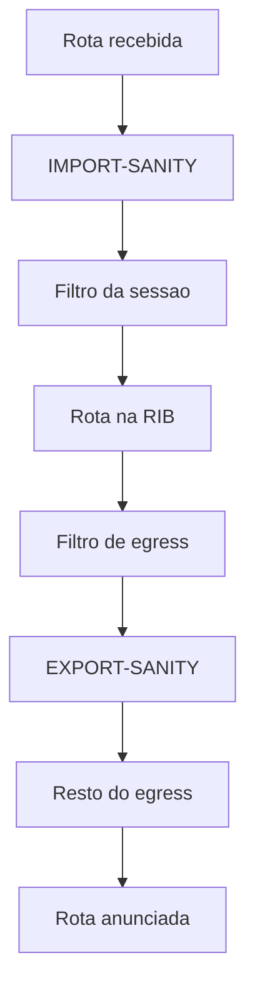
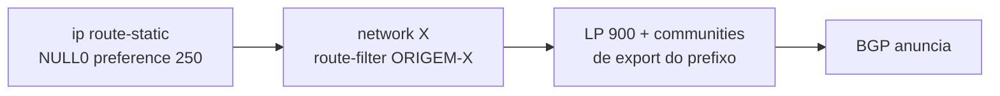
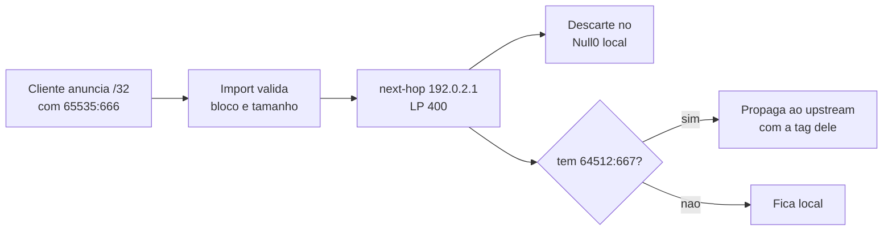

# Plano de Communities BGP — AS64512

2026-09-20 · @Someone

## Escopo e princípios

Este documento define o padrão de BGP communities do AS64512 e sua implementação em XPL no NetEngine 8000 F1A. Cobre clientes de trânsito, clientes residenciais e corporativos, parceiros, IX, PNI e upstreams, em IPv4 e IPv6.

Cinco regras estruturais sustentam todo o resto:

1. **Namespace único: 64512.** Toda community do plano carrega o namespace do AS da rede, e não um ASN codificado nos 16 bits baixos. O que o 64512 carimba leva o 64512.
2. **Sem separação v4/v6.** A família já está implícita no NLRI. Duplicar a tabela dobra o namespace e o esforço de manutenção sem nenhum ganho operacional.
3. **Informativa é escrita só pelo 64512.** O cliente lê, nunca escreve. Não existe remoção seletiva no ingress, então a defesa é por sessão: cliente tem prefix-list próprio, que confina o que ele pode anunciar, e sessão sem prefix-list (upstream, IX, PNI) entra com `overwrite`, que substitui o conjunto inteiro — dessas, nada escrito lá fora sobrevive. O que um cliente forjar no nosso namespace, se forjar, fica preso ao prefixo dele, porque é o único que a sessão pode anunciar. Só que desde a saída do `overwrite` de egress esse valor forjado chega ao peer externo: o dano possível é o anúncio dele mesmo — esconder-se, prependar-se ou marcar blackhole.
4. **Ação é escrita só pelo cliente.** O 64512 executa e não reescreve nada. A community de ação não tem significado para o peer, e depois da saída do `overwrite` de egress ela chega lá junto com o resto.
5. **Polaridade negativa.** O default é anunciar; a community restringe. Misturar com polaridade positiva (default não anuncia, tag libera) é exatamente como nasce route leak, quando uma rota escapa por um caminho sem tag nenhuma e o filtro daquele lado era negativo.

A convenção numérica se autodefende: **ação tem 3 dígitos, informativa tem 4**. É o que separa as duas classes sem lista de exceções, e o que deixaria a limpeza de informativa a cargo de um único regex se um dia houver remoção seletiva, que hoje não existe.

O namespace deste plano é o AS da rede, e quem o escreve é o topo do `peers.yaml`: o gerador lê a chave `asn` e monta toda community a partir dela — `64512:1100` no arquivo de hoje. O `64512` deste documento é o ASN privado de exemplo (RFC 6996), que é o valor de fábrica do gerador: quem aplicar o plano escreve o ASN da rede nesse mesmo campo. Numa rede cujo ASN não caiba nos 16 bits da RFC 1997, a chave `asn_politica` declara o namespace das standard à parte, e ele vale para o `5PPA`, o `6CA` e as informativas, que são todas standard. O ASN de verdade continua no `bgp`, no `apply as-path` e no terceiro campo da large, que tem 32 bits por campo.

Duas decisões de polaridade que valem registrar porque aparecem no legado e não devem voltar: ASN codificado nos 16 bits baixos da community (`64512:8167` para dizer "AS8167") é substituído por large community, e community de blackhole de terceiro é propagada, nunca obedecida.

## Mapa de faixas

Todo o namespace `64512:` está dividido nas faixas abaixo. Ação ocupa `100`–`699`; informativa ocupa `1000`–`9999`. Os dois blocos de quatro dígitos vivem dentro dessas faixas, não fora delas: `4PP0` é informativa como qualquer outra de quatro dígitos, e `5PPA` é a única ação que não tem três.

| Faixa             | Classe | Uso                                                           | Quem escreve |
| ----------------- | ------ | ------------------------------------------------------------- | ------------ |
| `64512:100–199`   | Ação   | Local preference                                              | Cliente      |
| `64512:200–299`   | Ação   | Escopo de anúncio                                             | Cliente      |
| `64512:5PPA`      | Ação   | Prepend e bloqueio por peer ou grupo específico (ID + ação)   | Cliente      |
| `64512:6CA`       | Ação   | Prepend por classe (upstream, IX, PNI, CDN, bilateral, todos) | Cliente      |
| `64512:666/667`   | Ação   | Blackhole e propagação de blackhole                           | Cliente      |
| `64512:4PP0`      | Info   | Peer de origem da rota (ID da tabela de peers)                | AS64512      |
| `64512:1000–1999` | Info   | Origem da rota                                                | AS64512      |
| `64512:2000–2999` | Info   | Classificação da rota e geografia                             | AS64512      |
| `64512:3000–3999` | Info   | Ponto de aprendizado (IX, upstream)                           | AS64512      |
| `64512:9000–9999` | Info   | RPKI, IRR e estado interno                                    | AS64512      |

A faixa `64512:5PPA` (identificador do cadastro + ação, detalhada na seção de prepend por classe) é a única exceção ao padrão "3 dígitos = ação": tem 4 dígitos porque carrega dois de identificador e um de ação, e por isso cai numericamente dentro da faixa das informativas. É o primeiro dígito que a salva — `5` não é casado pelo recorte de informativas, que só olha `1`, `2`, `3`, `4` e `9`.

O bloco `4PP0`, descrito mais adiante, não é exceção nenhuma: quatro dígitos começando em `4`, é informativa como as da faixa `1xxx`. A única coisa que ele exige é ficar documentado como subfaixa, para não se confundir com as demais de quatro dígitos.

As faixas `700` e `800` ficam livres de propósito, para expansão sem reorganizar o que já está publicado.

## Communities informativas

Informativas são carimbadas pelo AS64512 no ingress de toda sessão. A intenção original era que ficassem dentro do AS: o egress externo fechava num `overwrite` que substituía o conjunto inteiro, e nada do namespace `64512:` chegava a upstream, IX ou PNI. Esse `overwrite` saiu do desenho, então a rota chega ao peer carregando tudo o que acumulou, e quem decide o que sai é o `matches-any` de cada egress.

O preço é conhecido e está mapeado na seção sobre `overwrite` e `additive`: o `5PPA` e o `6CA` escritos pelo cliente viajam até o peer externo, e um cliente pode escrever no namespace da operadora. O `PL-CUST-<ID>-V4` do import confina esses casos ao prefixo do próprio cliente, e é por isso que ele não pode faltar em sessão nenhuma.

### Origem da rota — `1xxx`

| Community    | Significado                              |
| ------------ | ---------------------------------------- |
| `64512:1000` | Prefixo próprio do AS64512               |
| `64512:1100` | Cliente de trânsito (ISP downstream)     |
| `64512:1110` | Cliente residencial / FTTH               |
| `64512:1120` | Cliente corporativo / link dedicado      |
| `64512:1130` | Pool CGNAT / IP dinâmico                 |
| `64512:1200` | Peer bilateral / PNI                     |
| `64512:1300` | Peer via route server em IX              |
| `64512:1400` | Upstream (trânsito pago)                 |
| `64512:1500` | CDN / conteúdo (cache ou peering direto) |
| `64512:1900` | Infra interna — nunca sai do AS          |

O `1000` do prefixo próprio é escrito pelo filtro de originação, `ORIGEM-<endereco>_<mascara>`. Uma sessão cujo cadastro declare a origem `1000` também carimba esta marca no import, e o que distingue as duas é o `2000`, que só a rota aprendida carrega. Desde a mudança do `EXPORT-SANITY`, o `1000` do prefixo próprio identifica o prefixo no `display bgp routing-table` sem ser o que sustenta o anúncio.

Separar residencial de corporativo de CGNAT parece detalhe, mas é o que permite responder "esse /24 é de quem, e posso anunciá-lo?" sem consultar planilha.

### Classificação da rota — `2xxx`

O `64512:2000` marca rota aprendida de fora, e é escrito com `overwrite` no ingress de upstream, IX e PNI. A geografia divide a faixa com ele, fora da dezena das classes: `2001`–`2009` para POP e `2101`–`2199` para região, na tabela mais adiante.

| Community           | Significado                                                              |
| ------------------- | ------------------------------------------------------------------------ |
| `64512:2000`        | **Rota de full table** — aprendida de fora, não é própria nem de cliente |
| `64512:2010`        | Tier 1                                                                   |
| `64512:2020`        | Tier 2                                                                   |
| `64512:2030`        | Tier 3                                                                   |
| `64512:2040`        | Regional                                                                 |
| `64512:2050`        | IX público                                                               |
| `64512:2060`        | IX privado                                                               |
| `64512:2070`        | PNI                                                                      |
| `64512:2080`        | Peer bilateral                                                           |
| `64512:2090`        | CDN                                                                      |
| `64512:2091`        | Parceiro — downstream no roteador onde as CDNs peeram                    |
| `64512:2092`–`2099` | Reservado para ecossistema de CDN                                        |

As dezenas `2010` a `2090` estão catalogadas e **nenhum filtro deste documento as escreve ou lê**. Quem barra rota aprendida de fora no egress externo é o `EXPORT-SANITY`, que só libera marca de origem própria ou de cliente; essa checagem torna a classe redundante em upstream, IX e PNI. Elas ficam reservadas para o dia em que um egress precise distinguir de que tipo de peer a rota veio, coisa que hoje o próprio LP do import já separa. O `2091` saiu da reserva e já tem dono: é a marca de sessão do parceiro, o downstream que fica no roteador onde as CDNs peeram. Ele entra pelo import dessa sessão, ao lado da origem e do POP, e convive com a classe do cliente em vez de substituí-la, então a rota do parceiro continua em `CL-ORIGEM-ANUNCIAVEL` e sobe para upstream e IX como a de qualquer cliente. A subfaixa `2092`–`2099` segue a mesma lógica para o caso de haver mais de um PNI de CDN, quando vale separar o ecossistema (cache de busca, de vídeo, de rede social) em vez de marcar tudo como `2090`.

Quem impede a full table de sair é o `EXPORT-SANITY`, que roda antes da checagem do `2000` em todos os três egress externos. Essa checagem, portanto, não decide nada sobre rota aprendida de fora: quem vem de upstream, IX ou PNI carrega o `2000` e não carrega marca de origem, então o `EXPORT-SANITY` já a recusou antes de a checagem do `2000` ser alcançada. O que sobra para ela é o caso do parágrafo seguinte.

O que o `2000` ainda faz é marcar a rota para diagnóstico, já que `display bgp routing-table` mostra de imediato o que veio de fora, e barrar o único caso que o `EXPORT-SANITY` deixa passar: rota de cliente que chega com marca de origem e com `64512:2000` escrito pelo próprio cliente. O import de cliente é `additive` e não apaga o que ele manda, então essa escrita é possível.

Fora isso, o egress de cliente não tem gate nenhum: a full table sai para todo cliente que não peça o contrário. É o comportamento correto para cliente de trânsito, que é o caso do exemplo adiante. Se algum contrato não prevê full table, falta o ramo correspondente no filtro daquela sessão.

### Rota recebida de qual peer — `64512:4PP0`

| Community    | Significado            |
| ------------ | ---------------------- |
| `64512:4010` | Aprendida do peer 01   |
| `64512:4020` | Aprendida do peer 02   |
| `64512:4PP0` | Aprendida do peer `PP` |

Duplica o que `64512:1000:<ASN>` já diz em large community, de propósito. A standard é mais barata de casar em filtro e funciona em equipamento que não lê large. A large continua sendo a fonte precisa, porque carrega ASN de 32 bits.

### Geografia — subfaixa de `2xxx`

| Community    | Significado         |
| ------------ | ------------------- |
| `64512:2001` | POP Dourados        |
| `64512:2002` | POP Campo Grande    |
| `64512:2003` | POP São Paulo       |
| `64512:2101` | Região Centro-Oeste |
| `64512:2102` | Região Sudeste      |
| `64512:2199` | Internacional       |

### Ponto de aprendizado — `3xxx`

| Community    | Significado        |
| ------------ | ------------------ |
| `64512:3010` | IX.br São Paulo    |
| `64512:3011` | IX.br Campo Grande |
| `64512:3100` | Upstream #1        |
| `64512:3101` | Upstream #2        |
| `64512:3102` | Upstream #3        |

O detalhe por ASN vai na large community `64512:1000:<ASN>`, descrita adiante. A standard aqui serve para casar rápido em filtro; a large serve para identificar com precisão.

### RPKI e segurança — `9xxx`

| Community    | Significado                              |
| ------------ | ---------------------------------------- |
| `64512:9001` | RPKI Valid                               |
| `64512:9002` | RPKI NotFound                            |
| `64512:9003` | RPKI Invalid (apenas em modo observação) |
| `64512:9010` | Aceito via IRR / AS-SET                  |
| `64512:9011` | Aceito por exceção manual (ticket)       |
| `64512:9666` | Prefixo em blackhole                     |

## Communities de ação

Ações são escritas pelo cliente e executadas pelo AS64512. Toda ação é apagada antes da rota sair do AS.

### Local preference — `1xx`

Os valores internos padrão do AS64512 são: cliente 300, PNI 200, IX 190, upstream 100. As communities abaixo movem o prefixo do cliente em relação a essa escala.

| Community   | LP resultante | Intenção                   |
| ----------- | ------------- | -------------------------- |
| `64512:101` | 50            | Último recurso absoluto    |
| `64512:102` | 80            | Abaixo dos upstreams       |
| `64512:103` | 150           | Abaixo do IX e do peering  |
| `64512:104` | 250           | Abaixo dos demais clientes |
| `64512:105` | 350           | Acima dos demais clientes  |

### Escopo de anúncio — `2xx`

| Community   | Efeito                                   |
| ----------- | ---------------------------------------- |
| `64512:200` | Não anunciar para ninguém (mantém local) |
| `64512:201` | Não anunciar para upstreams              |
| `64512:202` | Não anunciar para peers bilaterais       |
| `64512:203` | Não anunciar para IX / route servers     |
| `64512:204` | Não anunciar para outros clientes        |
| `64512:210` | Anunciar **somente** para upstreams      |
| `64512:211` | Anunciar **somente** para IX             |
| `64512:212` | Anunciar **somente** para CDN / PNI      |
| `64512:213` | Anunciar **somente** para clientes       |

As `21x` são a única concessão à polaridade positiva, e ficam confinadas ao próprio bloco justamente para não contaminar o resto do esquema.

### Prepend por classe de peer — `64512:6CA`

A escala de prepend vai de **P1 a P7**, onde P1 é anunciar sem prepend nenhum e P7 são seis prepends. Ter o P1 explícito importa: dá ao cliente uma forma de dizer "anuncie normalmente aqui" sem depender do default.

O dígito de ação é o mesmo nos dois eixos, por peer e por classe:

| Dígito    | Efeito                                                     |
| --------- | ---------------------------------------------------------- |
| `0`       | Não anunciar para este destino                             |
| `1` a `4` | P1 a P4 — 0, 1, 2 ou 3 prepends                            |
| `5` a `7` | P5 a P7 — reservados, ainda sem ramo nos filtros de egress |
| `8`       | Anunciar com `no-export` — ainda sem ramo nos filtros      |
| `9`       | Default explícito (cai no fim da cadeia)                   |

**Por classe de peer — `64512:6CA`**, três dígitos, onde `C` é a classe:

| Classe           | `C` | Exemplo P3 (2 prepends) |
| ---------------- | --- | ----------------------- |
| Upstreams        | `1` | `64512:613`             |
| IX público       | `2` | `64512:623`             |
| IX privado e PNI | `3` | `64512:633`             |
| CDN              | `4` | `64512:643`             |
| Peer bilateral   | `5` | `64512:653`             |
| Todos            | `7` | `64512:673`             |

A classe `6` fica reservada para não colidir com `666` e `667`.

**Por peer ou grupo específico — `64512:5PPA`**, quatro dígitos começando com `5`, onde `PP` é o identificador do cadastro (peer ou grupo) na tabela de peers:

| Envio        | Efeito                              |
| ------------ | ----------------------------------- |
| `64512:5010` | Não anunciar para o peer 01         |
| `64512:5013` | P3 no peer 01 — dois prepends       |
| `64512:5014` | P4 no peer 01 — três prepends       |
| `64512:5101` | P1 no peer 10 — anuncia sem prepend |

O `5PPA` não colide com o regex de informativas, que casa apenas `1`, `2`, `3`, `4` e `9` no primeiro dígito.

**Ponto em aberto:** a escala publicada vai até P7, mas os filtros de egress deste documento implementam P1 a P4 (0 a 3 prepends) e o dígito `9`, que não precisa de ramo nenhum porque cai no fim da cadeia. Os dígitos `5`, `6`, `7` e o `8` (`no-export`) precisam do ramo correspondente antes de a faixa ser divulgada ao cliente; a tabela de large communities também para em 3x de prepend, que é o mesmo teto.

Para o dígito `8` há um atalho que dispensa convenção nossa: o `no-export` bem conhecido (`65535:65281`) tem o mesmo efeito e o peer o obedece sem precisar ler nada nosso. O `apply community no-export` na linha de egress resolve o caso. Confirme se o `route-filter` aceita o nome simbólico, ou se é preciso o valor numérico.

### Blackhole e manutenção — `6xx`

| Community   | Efeito                                                |
| ----------- | ----------------------------------------------------- |
| `65535:666` | RTBH — padrão RFC 7999, é o gatilho oficial           |
| `64512:666` | Alias interno; ambos são aceitos                      |
| `64512:667` | RTBH e propagar aos upstreams que aceitam             |
| `65535:0`   | Graceful Shutdown (RFC 8326) — aplica LP 0 no ingress |

Community de blackhole de terceiro (`8167:666`, `37468:666` e semelhantes) é propagada quando apropriado, mas **nunca** usada como gatilho na rede do AS64512. Obedecer a tag de outro AS deixa qualquer rota em trânsito capaz de disparar descarte local.

**Ponto em aberto:** o ingress de peer externo (upstream, IX, PNI) substitui o conjunto inteiro com `overwrite`, então uma community de terceiro que chegue por essas sessões não sobrevive para ser propagada. A propagação descrita acima só acontece hoje dentro do AS, de rota de cliente para outro cliente. Propagá-la para fora exigiria ler a community antes do `overwrite`, o que este desenho ainda não faz.

## Large communities e controle por peer

A large community resolve o que a standard não comporta: ASN de 32 bits no campo de valor. O formato é `64512:<função>:<ASN>`, conforme a RFC 8195.

### Ações por ASN

| Large community | Efeito                            |
| --------------- | --------------------------------- |
| `64512:0:<ASN>` | Não anunciar para `<ASN>`         |
| `64512:1:<ASN>` | Prepend 1x para `<ASN>`           |
| `64512:2:<ASN>` | Prepend 2x para `<ASN>`           |
| `64512:3:<ASN>` | Prepend 3x para `<ASN>`           |
| `64512:4:<ASN>` | Anunciar **somente** para `<ASN>` |

A vantagem operacional é que a tabela publicada nunca muda. Trocou de upstream, entrou num IX novo, fechou um PNI: o cliente já sabe o ASN e já sabe a community. Zero comunicação, zero atualização de documentação.

### Informativas por ASN

| Large community       | Significado                       |
| --------------------- | --------------------------------- |
| `64512:1000:<ASN>`    | Rota aprendida do vizinho `<ASN>` |
| `64512:1001:<IX-ID>`  | Aprendida no IX (ID do PeeringDB) |
| `64512:1002:<POP-ID>` | POP de entrada                    |

### Alias em standard community — `64512:5PPA`

Nem todo cliente consegue enviar large community: equipamento antigo, RouterOS em versão velha, ou NOC que não sabe configurar. Oferecer só large significa que metade não usa. O alias em standard cobre esses casos.

O formato é o mesmo da seção de prepend por peer: `64512:5` + dois dígitos do identificador do cadastro + o dígito de ação da escala P1 a P4. O bloco `4xxx` fica reservado para a informativa `4PP0`, que diz de qual peer a rota veio. Se as duas coisas dividissem o mesmo dígito, `64512:4010` seria ao mesmo tempo "rota aprendida do peer 01" e "não anunciar para o peer 01".

| Envio        | Equivalente em large community                |
| ------------ | --------------------------------------------- |
| `64512:5010` | `64512:0:<ASN>` — não anunciar                |
| `64512:5011` | P1 explícito; não existe equivalente em large |
| `64512:5012` | `64512:1:<ASN>` — prepend 1x                  |
| `64512:5013` | `64512:2:<ASN>` — prepend 2x                  |
| `64512:5014` | `64512:3:<ASN>` — prepend 3x                  |

O eixo large tem uma ação que o eixo standard não tem: `64512:4:<ASN>`, anunciar somente para um ASN, que hoje só existe em large community.

Exemplos: `64512:5013` é P3 (dois prepends) no peer de ID 01; `64512:5020` não anuncia para o peer de ID 02; `64512:5101` é P1 (sem prepend) no peer de ID 10.

### Precedência

**O específico vence o genérico.** Um cliente que envia `64512:613` (P3, dois prepends em todos os upstreams) junto com `64512:5012` (P2, um prepend no peer 01) recebe 1x no peer 01 e 2x nos demais. Isso cobre o caso mais comum de todos: prepend em tudo, menos no upstream preferido.

Em XPL a precedência sai de graça com `if` / `elseif`, sem aritmética de número de nó.

## Tabela de peers e IDs

Esta tabela é a fonte única de verdade para o alias `64512:5PPA`, para a classe `64512:6CA` e para as informativas `64512:3xxx` e `4PP0`. Os ASNs `64501`, `64502`, `64510` e `64511` são **exemplos e precisam ser substituídos** pelos reais antes de publicar; o `14840` é o upstream real que aparece nos exemplos de filtro adiante.

| ID   | Peer                    | ASN   | Tipo         | Info `3xxx`  |
| ---- | ----------------------- | ----- | ------------ | ------------ |
| `01` | Upstream #1             | 14840 | Trânsito     | `64512:3100` |
| `02` | Upstream #2             | 64501 | Trânsito     | `64512:3101` |
| `03` | Upstream #3             | 64502 | Trânsito     | `64512:3102` |
| `10` | IX.br São Paulo (RS)    | 26162 | Route server | `64512:3010` |
| `11` | IX.br Campo Grande (RS) | 26162 | Route server | `64512:3011` |
| `20` | PNI — CDN A             | 64510 | Bilateral    | —            |
| `21` | PNI — CDN B             | 64511 | Bilateral    | —            |

O ID `01` é o do AS14840, upstream real já em produção e usado em todos os exemplos deste documento. Peer novo entra no primeiro ID livre da faixa `0x`.

O ID também é o que endereça um prefixo a um peer específico no tratamento por prefixo do cliente (adiante): num par de upstreams do mesmo ASN, o `5PPA` do ID distingue os dois links, que a community por ASN não distingue.

### Geração por template

Com 3 upstreams, 2 IXs e 2 PNIs, esta tabela produz cerca de 60 sets e 50 ramos de filtro. Escrever isso à mão é onde nasce o erro que derruba BGP na madrugada de sábado.

A recomendação é manter um único YAML com `id`, `nome`, `asn`, `tipo` e `prefixos`, e gerar a configuração com Jinja2 mais `bgpq4`. A lista agregada de prefixos de cliente sai da soma das individuais, nunca digitada em separado — foi exatamente assim que o legado acumulou um `/22` autorizado para dois ASNs diferentes e um prefixo órfão sem dono.

## Identificador compartilhado entre peer e grupo

O identificador de dois dígitos é um recurso único do AS64512, e não um campo
de cada cadastro. Peers e grupos disputam os mesmos 100 números, porque o
mesmo número aparece no eixo de community dos dois: `plan.c5ppa` monta
`64512:5<id><papel>`, com dois dígitos de identificador e um de papel, e a
`CL-NOADV-<G>` de um grupo carrega o identificador do grupo.

Consequências que valem para quem edita a tabela acima:

- Um número pertence a um peer ou a um grupo, nunca aos dois. O gerador
  recusa o cadastro que colide, nos dois sentidos, em vez de renumerar.
- A faixa é 0 a 99, sem exceção. Fora dela o `%02d` do `c5ppa` truncaria
  calado, e dois cadastros escreveriam a mesma community.
- Renumerar um cadastro é decisão do operador, porque o número é publicado:
  ele aparece na community que o cliente escreve para pedir prepend, e mudá-lo
  sem aviso quebra o que já foi combinado.
- Um grupo de cliente ou de parceiro não emite `5PPA`, então o número dele é
  reservado mesmo quando não aparece em configuração nenhuma.

## Grupo nos cinco tipos

Os cinco tipos podem ter grupo BGP no equipamento. O grupo existe para o caso
de vários links com uma política só: dois ou três acessos ao mesmo trânsito,
um IX visto por mais de um route server, um PNI com mais de um link direto.
Sem grupo, cada link é um cadastro avulso que repete o mesmo filtro com um
token diferente, e a política dos dois diverge na primeira edição feita num só.

O que o grupo carrega e o membro herda:

| Tipo | Objetos do grupo | O que o membro acrescenta |
| --- | --- | --- |
| `cliente`, `parceiro` | `CUST-<G>-IMPORT/EXPORT-<U>`, `PL-CUST-<G>-<U>`, `PL-CUST-<G>-BH-<U>`, `AP-CUST-<G>` | o `route-limit`, o export por ASN quando o grupo não tem ASN, e, se o link tiver prefixo próprio, o filtro de import dele |
| `upstream` | `UP-<G>-IMPORT/EXPORT-<U>`, `PL-TE-PREFER-<G>-<U>`, `CL/LC-NOADV-<G>`, `CL-5PPA-<id>`, `LC-5PPA-<G>`, `LC-PREP1/2/3-<G>`, `AP-BLOCK-<G>`, `AP-TE-PREFER-<G>`, `APPLY-PEER-<G>` | idem |
| `ix` | `IX-<G>-IMPORT/EXPORT-<U>`, `CL/LC-NOADV-<G>`, `AP-IX-<G>` | idem |
| `pni` | `PNI-<G>-IMPORT/EXPORT-<U>`, `CL/LC-NOADV-<G>`, `AP-<G>-ALLOWED` | idem |

O `<G>` é o nome do grupo e o `<U>` é `V4` ou `V6`. O `APPLY-PEER-<G>` é o
único da lista que o bloco do grupo só chama: quem o define é a saída do quadro
"ao criar o grupo".

Duas regras que valem para os cinco:

- O `route-limit` fica no membro, e não no grupo. Ele é da sessão, e um limite
  só para todos os membros apagaria o de cada um.
- O que é de sessão (AS-path confinado, timers, `bfd`, graceful-restart,
  `advertise-community`) sai uma vez, no bloco do grupo. O membro só referencia
  o `group`.

Num grupo de `cliente` ou de `parceiro` **sem `asn`** cada membro tem o ASN
dele, e o export do grupo, um só para todos, não tem como avaliar os controles
que olham o ASN do destinatário: o `64512:0:<ASN>` (não anunciar) e o
`64512:1/2/3:<ASN>` (prepend). Por isso o membro leva um `CUST-<T>-EXPORT-<U>`
próprio com esses dois blocos para o ASN dele, e esse filtro chama o
`CUST-<G>-EXPORT-<U>` do grupo pelo resto: a política comum continua num lugar
só, e o `finish` do filtro chamado encerra o do membro, como no import. Num
grupo **com `asn`** nada disso sai: o export do grupo já carrega os controles
daquele ASN, que o validar exige ser o de todos os membros.

A community do bloco de sessão (`CL-PEER-<G>`) segue a mesma diferença entre os
tipos que a seção "Communities de peer: `CL-PEER-<T>` e `APPLY-PEER-<T>`", em
"Route-filters reutilizáveis", descreve: num cliente ela descreve o link, e cada
membro pode ter a sua; num upstream ela descreve a rede remota, então mora no
grupo e vale para os dois links. Por isso o gerador só tem quadro "ao criar" no
grupo de `upstream`, onde a `CL-PEER-<G>` é uma só para todos os membros e o
quadro é quem define os dois objetos que o bloco do grupo apenas chama. Nos
quatro outros ele não existe: num grupo de `cliente` ou de `parceiro` a
community de sessão descreve o link, e cada membro tem a sua, então o quadro
criaria uma `CL-PEER-<G>` e um `APPLY-PEER-<G>` que nenhum filtro do grupo
chama; e nos grupos de `ix` e de `pni` não há esse par, porque o egress dos dois
não aplica community de sessão nenhuma.

## Reaproveitamento de política entre peers

Dois links do mesmo cliente, um principal e um backup, têm a mesma política e
o mesmo ASN. Escrever o par de filtros duas vezes faz a política dos dois
divergir na primeira edição feita num só, e o grupo resolve isso criando um
`peer group` no equipamento, que é um objeto a mais e faz os membros
compartilharem também o que é de sessão.

O campo `politica_de` no cadastro do peer resolve o mesmo problema sem grupo:
o segundo link não define objeto nenhum e chama os filtros do primeiro pelo
nome dele.

```scss
bgp 64512
 peer 198.51.100.10 as-number 270620
 peer 198.51.100.10 description NETMAC-BKP
 peer 198.51.100.10 route-limit 50 alert-only
 peer 198.51.100.10 public-as-only force
 ipv4-family unicast
  peer 198.51.100.10 enable
  peer 198.51.100.10 route-filter CUST-NETMAC-IMPORT-V4 import
  peer 198.51.100.10 route-filter CUST-NETMAC-EXPORT-V4 export
  peer 198.51.100.10 advertise-community
  peer 198.51.100.10 advertise-large-community
```

O que o peer que reaproveita guarda de próprio é a sessão inteira: IPs,
`route-limit`, `public-as-only force`, timers, `bfd`, graceful-restart,
`advertise-community` e `advertise-large-community`. O que vem da origem é a
política, incluindo o LP, que mora dentro do filtro de import. Os dois links
ficam com a mesma preferência, e a diferença entre eles vem do que o cliente
anuncia em cada um.

A origem tem que ser dona da própria política: não pode reaproveitar de
outro nem estar num grupo. E ninguém apaga uma origem enquanto alguém a
reaproveita.

Renomear o apelido da origem troca o token dela e com ele o nome dos objetos
que quem reaproveita chama: o bloco do segundo link fica apontando para nomes
que o equipamento não tem mais, até ser gerado de novo.

## Referência de sintaxe XPL

O XPL é mais expressivo que `route-policy`, mas tem armadilhas de parsing que não estão evidentes na documentação. Esta seção registra o que foi verificado no F1A, por `?` contextual e por simulação com `xpl simulate` — o método está na seção de validação, no fim do documento.

### Aspas por cláusula — não há regra unificadora

| Cláusula        | Aspas   | Evidência                                        |
| --------------- | ------- | ------------------------------------------------ |
| `regular`       | **Sem** | `regular _0_`, `regular ^$`                      |
| `origin`        | **Com** | `origin ?` retorna apenas `'`                    |
| `pass`          | **Com** | `pass ?` retorna apenas `'`; `pass ''` é erro    |
| `peer-is`       | **Com** | `peer-is ?` retorna apenas `'`                   |
| `length`        | **Sem** | `length '222'` é erro; aceita `eq` / `ge` / `le` |
| `unique-length` | **Sem** | Mesma família de `length`                        |

Dentro de `route-filter` as aspas funcionam em contextos onde no set não funcionam. Na dúvida, `?` depois da palavra-chave resolve em dois segundos.

### Cláusulas de AS-path sem regex

O VRP oferece primitivas semânticas que evitam regex. A documentação da Huawei recomenda no máximo 100 expressões regulares por política e alerta que o processamento é intensivo em CPU, degradando conforme cresce o atributo avaliado — em rota full-table o AS-path é longo.

| Cláusula               | Casa                                        | Equivalente regex |
| ---------------------- | ------------------------------------------- | ----------------- |
| `origin '<asn>'`       | AS que originou o prefixo (último do path)  | `_<asn>$`         |
| `pass '<asn>'`         | AS em qualquer posição do path              | `_<asn>_`         |
| `peer-is '<asn>'`      | AS diretamente adjacente (primeiro do path) | `^<asn>_`         |
| `length ge <n>`        | Tamanho do AS-path                          | —                 |
| `unique-length ge <n>` | Tamanho ignorando prepends                  | —                 |

A diferença entre `origin` e `pass` é política, não cosmética. `origin '270814'` recusa o que esse AS anuncia como dele, mas aceita se ele for apenas trânsito de um terceiro. `pass '270814'` recusa qualquer coisa que passe por ele.

`pass` aceita faixa: `pass '[64496..64511]'` cobre um intervalo inteiro num único elemento.

### `whole-match`

Modificador por elemento, colocado após o valor. Transforma o match de OU em E quando a string contém vários ASNs.

```text
pass '64500 64501'              => passa por 64500 OU 64501
pass '64500 64501' whole-match  => passa por 64500 E 64501
```

Confirme o comportamento com `display xpl as-path-list <nome>` antes de depender dele. O uso mais direto é detecção de leak: rota que transita por dois upstreams seus ao mesmo tempo é quase sempre vazamento.

Para listas de bogon, `whole-match` seria errado — ali se quer OU, que já é o default entre elementos separados por vírgula.

### Armadilhas de fluxo

1. **`approve` NÃO encerra o processamento.** A documentação da Huawei define `approve` como "filtra novamente as rotas que casaram no branch atual contra o próximo branch `if`". O filtro continua. Quem encerra é `finish` (permitindo), `refuse` (negando), `break` (devolvendo o controle a quem chamou) ou o último branch `if`.
2. **Use `finish` quando quiser terminar ali.** Um ramo de blackhole que aprova com `approve` e depois cai num `EXPORT-SANITY` tem a rota `/32` recusada logo em seguida, porque o ramo não deixa a marca de origem que a checagem exige. O ramo precisa de `finish`.
3. **`and` liga mais forte que `or`.** `A or B and C` é lido como `A or (B and C)`. Use parênteses em toda condição mista.
4. **`overwrite` substitui o conjunto inteiro.** Sempre `overwrite` primeiro, `additive` depois.
5. **Filtro vazio ou sem ação executada é `refuse` por padrão.** A documentação diz que, se nem `finish`, nem `refuse`, nem um `apply` tiverem executado ao fim do processamento, a rota é negada. Verificado no F1A: um `break` de fecho, sem nenhum `apply` executado no caminho, **não** dispara essa negação — o controle volta para quem chamou e a rota segue. É o que permite os sub-filtros de sanidade deste documento fecharem em `break`.
6. **`apply as-path` em XPL recebe ASN + contador, não uma lista de ASNs repetidos.** `apply as-path 64512 3 additive` prepende o AS64512 três vezes. É diferente do `route-policy` clássico do VRP, onde `apply as-path 64512 64512 64512 additive` lista os ASNs a prepender um por um. Confirmado via `?` no equipamento. O campo aceita **asplain de 32 bits**: `apply as-path ?` oferece `INTEGER<1-4294967295>`, e `apply as-path 264130 3 additive` foi aceito em `rt-tecmais-ne8k`. É o que permite um plano de ASN de 32 bits prependar sem passá-lo pelo namespace das standard.
7. **`advertise-community` não é default no VRP**, inclusive em iBGP. Sem ele a community simplesmente não sai.
8. **Coringa `*` substitui campo inteiro.** `64512:*` funciona, `64512:1*` não.

### `finish`, `break` e `refuse` num filtro chamado

Verificado no F1A com `xpl simulate` num par de filtros de dois níveis, um chamando o outro. O terminador do filtro **chamado** decide a sorte do filtro que o chamou:

| Terminador no filtro chamado          | Efeito                                                                          |
| ------------------------------------- | ------------------------------------------------------------------------------- |
| `finish`                              | Permite a rota e encerra a cadeia inteira. O chamador **não** continua.         |
| `break`                               | Sai do filtro chamado e devolve o controle; o chamador segue no ponto seguinte. |
| `refuse`                              | Nega a rota e encerra a cadeia.                                                 |
| `break` sem nenhum `apply` no caminho | Devolve o controle limpo, sem disparar a negação implícita da armadilha 5.      |

O `finish` é o caso que a documentação não deixa claro, e sai ao contrário do que a intuição sugere: `call route-filter` **não** é chamada de sub-rotina com retorno ao ponto de origem. Um `finish` lá dentro aprova a rota e termina o processamento como se estivesse no filtro de fora. A descrição da Huawei para `call` — "filtra novamente as rotas que casam no filtro atual contra o filtro especificado" — sugere uma devolução de controle que, na prática, só o `break` entrega.

Daí a regra que rege este documento: **filtro compartilhado que roda no meio de outro fecha em `break`, e quem dá o veredito é sempre o filtro da sessão.** Vale para `IMPORT-SANITY`, `EXPORT-SANITY`, `APPLY-CUSTOMER-LP` e os `APPLY-PEER-<T>`. Nenhum deles dá o veredito: todos devolvem o controle.

As três primeiras linhas da tabela saíram de rotas reais comparadas antes e depois: a recusada some da tabela BGP simulada, a permitida aparece nela. A quarta linha usou a mesma montagem, com a rota passando pelo filtro chamado, sem casar em ramo nenhum e chegando ao `break` de fecho: a rota sobreviveu até o `finish` do chamador.

### Comentários

Comentário em XPL começa com `!-`, conforme a cláusula `!-comment` listada pelo `?` dentro das views de set e de route-filter.

```scss
xpl route-filter EXEMPLO
 !- este e um comentario valido
 if community matches-any CL-BLACKHOLE then
  finish
 endif
 end-filter
```

O `#` que aparece entre blocos na saída de `display current-configuration` é separador de seção do VRP, não comentário. Usar `#` dentro de um filtro não comenta nada.

### Parâmetros não funcionam dentro de `if`

Um parâmetro de filtro (`$prepend_base`, `$lp_base`) só é válido como **valor substituído** dentro de uma cláusula existente — `apply local-preference $lp_base`, `apply as-path 64512 $prepend_base additive`, `if ip route-destination in {$prefixo}`. Ele não funciona como a condição inteira: `if $prepend_base eq 1 then` falha, porque XPL não tem uma cláusula de condição genérica "compare este valor com aquele" — as cláusulas de condição são todas amarradas a atributos de rota (community, as-path, prefixo, tag, MED), não a comparação de parâmetros entre si.

Isso muda onde a aritmética "P1 é zero prepends, P2 é um prepend..." acontece. Não dá para fazer a conta dentro do filtro com um `if`; ela precisa ser feita antes, por quem gera a linha `peer ... route-filter ...($valor) export`. O parâmetro passado já é o resultado — a contagem de prepends, de 1 a 6 — e o filtro só usa esse valor direto:

```scss
 apply as-path 64512 $prepend_base additive
```

`0` não é aceito: `apply as-path <asn> 0 additive` dá erro no equipamento, e o mínimo da cláusula é 1. Verificado em `rt-tecmais-ne8k-bgp-ddos`. A sessão que não quer prepend de engenharia simplesmente não recebe o argumento, então a escala do parâmetro é 1 a 6 e o caso zero não existe.

Isso deixa uma pergunta em aberto, que vale resolver com `?` antes de escolher a forma: se a assinatura declara `($prepend_base)`, chamar o filtro sem os parênteses é aceito? Se não for, o caso sem prepend exige uma segunda variante do filtro, sem o parâmetro na assinatura.

### `call route-filter` para eliminar duplicação

Toda sessão de cliente repete a mesma escada de local preference. Em vez de copiar o bloco `if/elseif` em cada filtro de import, ele vira um `route-filter` chamado uma vez:

```scss
xpl route-filter APPLY-CUSTOMER-LP
 if community matches-any CL-GSHUT then
  apply local-preference 0
  break
 endif
 if community matches-any {64512:101} then
  apply local-preference 50
  break
 endif
 if community matches-any {64512:102} then
  apply local-preference 80
  break
 endif
 if community matches-any {64512:103} then
  apply local-preference 150
  break
 endif
 if community matches-any {64512:104} then
  apply local-preference 250
  break
 endif
 if community matches-any {64512:105} then
  apply local-preference 350
  break
 endif
 apply local-preference 300
 break
 end-filter
```

O fecho é `break`, não `finish`. Cada ramo precisa encerrar ali, senão o ramo seguinte sobrescreve o LP recém-gravado — é para isso que a escada existe. Mas o `CUST-IMPORT-*` ainda tem trabalho a fazer depois da chamada, e `finish` encerraria o filtro de fora junto.

O import do cliente encolhe para:

```scss
 call route-filter APPLY-CUSTOMER-LP
 apply community {64512:1100, 64512:2001} additive
 apply large-community {64512:1000:268127} additive
 finish
```

Um cliente novo passa a herdar qualquer ajuste na escala de LP automaticamente, sem editar N filtros.

**Resolvido no F1A, contra a leitura que sustentava este desenho.** Um `finish` dentro do filtro chamado **encerra o filtro de fora**, e a rota não volta para quem chamou. Era exatamente o cenário ruim descrito aqui antes: o import do cliente para na chamada e nunca chega aos `apply community` seguintes, a rota entra sem `64512:1100`, o `EXPORT-SANITY` a recusa em todo egress, e o cliente que usa a community `101` a `105` some da internet sem nenhum erro aparecer no equipamento.

Quem devolve o controle é `break`. Com ele, o desenho desta seção funciona como sempre pretendeu: a rota sai de `APPLY-CUSTOMER-LP` com o LP gravado e o `CUST-IMPORT-*` segue nas linhas depois do `call`. A tabela completa dos terminadores está na seção de armadilhas de fluxo, na referência de sintaxe.

### `apply community` só tem `overwrite` e `additive`

Não existe `apply community <lista> delete` em route-filter. As duas únicas operações são substituir o conjunto inteiro (`overwrite`) ou acrescentar a ele (`additive`). O `delete` existe em outro contexto, não aqui.

Isso tem consequência direta de desenho:

| Onde                          | O que dá para fazer                                                                                                                                                                                          |
| ----------------------------- | ------------------------------------------------------------------------------------------------------------------------------------------------------------------------------------------------------------ |
| Ingress de cliente            | Nada é removível seletivamente. Sobrescrever apagaria as ações do cliente, que só são consumidas no egress. Solução: não limpar no ingress, e confiar no prefix-list da sessão para o que ele pode anunciar. |
| Ingress de upstream, IX e PNI | `overwrite` logo no início, antes de qualquer `additive`. Não há ação de cliente a preservar nessas sessões, e é o que garante que community nenhuma vinda de fora chegue viva à RIB.                        |
| Egress                        | Nada é limpo. O `overwrite` de fecho apagava junto as communities que a operadora precisa enviar ao peer, e a única saída era reescrevê-lo por sessão. Ele saiu; ver as communities de peer, mais adiante.   |

A ordem dentro de um mesmo filtro importa: `overwrite` substitui o conjunto inteiro, então ele tem que vir antes dos `additive`. Invertido, apaga o que acabou de ser gravado. Depois desta mudança o `overwrite` só aparece no ingress de upstream, IX e PNI, e no ramo de blackhole do export de upstream.

### O que o egress externo deixou de limpar

O `overwrite` de fecho existia para zerar o namespace na saída, e fazia isso bem. O problema era o que ele levava junto. `overwrite` substitui o conjunto inteiro, então qualquer community aplicada antes dele naquele mesmo filtro desaparecia. Aplicar a community do upstream e limpar não cabiam na mesma passada: as duas operações disputavam o mesmo conjunto.

Como `apply community delete` não existe, a saída era embutir o valor da limpeza no próprio `overwrite`, reescrevendo-o a cada sessão. Funcionava, mas amarrava o gerador a um valor por peer e não deixava lugar nenhum para acrescentar coisa depois. O que ficou no lugar está nas communities de peer, mais adiante: duas listas por sessão, mantidas à mão, aplicadas com `additive`.

Consequências, para não haver surpresa em campo:

| O que passa a sair                                | Por quê                                                                                                   |
| ------------------------------------------------- | --------------------------------------------------------------------------------------------------------- |
| `5PPA` e `6CA` escritos pelo cliente              | O prepend e o escopo que ele contratou viajam até o peer externo. Antes morriam no egress.                |
| As informativas `64512:1xxx`–`64512:4xxx`         | Deixam de ser visíveis só dentro de casa. Nenhuma delas é segredo operacional, mas o peer passa a vê-las. |
| `64512:4:<ASN>`, `64512:2:<ASN>`, `64512:3:<ASN>` | Um cliente que escreva essas large communities revela ID de peer e prepend contratado de terceiros.       |
| `64512:667`                                       | A marca de propagação de blackhole sai junto. O peer a ignora, e nós a lemos no egress de upstream.       |

O que confina tudo isso continua sendo o `PL-CUST-<ID>-V4`, e agora com mais peso. Nas sessões de cliente as communities chegam intactas à RIB, e o próprio import carimba `64512:1100` em tudo que o cliente manda. O `matches-any` do export, sozinho, não confina prefixo nenhum nessa sessão: quem confina é o prefix-list do import, que roda antes de a rota entrar. Sem ele, o import carimba origem em qualquer prefixo que o cliente anunciar e o export aprova, com as communities do cliente viajando coladas.

**Ponto em aberto:** a limpeza de large community no egress deixa de ser item separado, já que não há mais limpeza nenhuma. Se algum dia voltar, ela precisa cobrir `apply large-community` explicitamente: `overwrite` de standard community não toca em large community.

Conjunto vazio não é aceito. Confirmado no equipamento:

```scss
apply community {} overwrite
```

O parser recusa, e o achado é o que sustenta o desenho atual. Sem poder gravar conjunto vazio, uma limpeza por `overwrite` era obrigada a gravar alguma community, e a única coisa honesta a gravar ali é a community daquele peer. De gravar uma, o passo seguinte é dar ao operador o controle dessa uma: é o que o par `CL-PEER-<T>` e `APPLY-PEER-<T>` faz, mais adiante.

A regra continua valendo para todo `overwrite` que restar neste documento: nunca com `{}` dentro.

Antes de qualquer `overwrite` de egress rodar, a rota já passou pelo `EXPORT-SANITY`. Essa ordem é obrigatória: a checagem precisa ver as communities de origem reais. Se o `overwrite` viesse antes, uma rota que chegasse ao export carregando só o valor que ele grava não casaria em `CL-ORIGEM-ANUNCIAVEL` e seria recusada por falta de origem, não por política.

### Conjunto de prefixo inline

Um prefixo casado direto na condição leva endereço e comprimento separados, sem barra, e o `le` é o que estende o casamento aos mais específicos:

```scss
 if ip route-destination in {45.169.232.0 22 le 24} then
```

`{45.169.232.0 22 le 24}` casa o `/22` e os mais específicos até `/24`. Sem o `le` o casamento é o prefixo exato, e o `ge`/`le` junto casa um comprimento fixo: `{0.0.0.0 0 ge 32 le 32}` é a rota de host. É a mesma forma da entrada de uma prefix-list nomeada, sem o objeto no meio.

Quando mais de uma linha pode casar a mesma rota, quem decide é a ordem do `if`/`elseif`: do prefixo mais longo para o mais curto e, no mesmo prefixo, a linha exata antes da de intervalo, para o `/24` vencer o `/22` e o `/22` exato vencer o `/22-24` em vez de os dois somarem.

A linha do cadastro escreve esse conjunto sem o `le` quando quer o prefixo exato, e com o `le` quando quer os mais específicos: `138.97.60.0/22` e `138.97.60.0/22-24` são o mesmo prefixo com alcances diferentes.

A entrada de uma prefix-list nomeada segue a mesma convenção, e é a forma que o `PL-CUST` usa: `45.169.232.0 22` é o prefixo exato e `45.169.232.0 22 le 24` alcança os mais específicos até `/24`.

**Ponto em aberto:** que a forma inline aceite `le` sem `ge`, e que ela valha no v6 com o mesmo `ip route-destination` que os exemplos usam nas duas famílias. O desenho do tratamento por prefixo assume as duas coisas, e a entrada exata da prefix-list (sem `ge`/`le`) assume a leitura clássica: casa aquele prefixo e nada mais.

### Condição em uma linha

O XPL não aceita quebra de linha dentro de `if`. Toda a condição, incluindo os `and` e `or`, tem que caber numa linha só. Quebrar para legibilidade gera erro de sintaxe ao colar a configuração.

Isso torna cadeia longa de `or` impraticável. A saída é agregar os valores num community-list e casar uma vez:

```scss
!- em vez de quatro condicoes encadeadas
xpl community-list CL-NOADV-UP1
 64512:200,
 64512:201,
 64512:5010
 end-list

!- a condicao vira uma linha curta
 if community matches-any CL-NOADV-UP1 or large-community matches-any LC-NOADV-14840 then
  refuse
 endif
```

Há também ganho de custo: um `matches-any` contra um set é mais barato que quatro condições avaliadas em sequência, e a lista fica num lugar só quando precisar mudar.

Evite acentos em comentários: a configuração trafega por TFTP, backup e diff, e caracteres fora de ASCII costumam quebrar em algum ponto da cadeia.

Os blocos de código levam `scss` na cerca de abertura. Não existe gramática publicada de XPL, e `scss` é o rótulo que os renderizadores já conhecem e que colore os identificadores hifenizados sem quebrá-los pela metade. O conteúdo dos blocos continua sendo XPL.

## Sets XPL

Sets são dados puros, sem ação de permit ou deny. Só filtram quando referenciados por um `route-filter`.

Convenção de nomes: `TIPO-FUNÇÃO-ESCOPO`, tudo maiúsculo. `PL` para prefix-list, `AP` para as-path-list, `CL` para community-list, `LC` para large-community-list.

### Bogons de prefixo

```scss
xpl ip-prefix-list PL-BOGONS-V4
 0.0.0.0 8 le 32,
 10.0.0.0 8 le 32,
 100.64.0.0 10 le 32,
 127.0.0.0 8 le 32,
 169.254.0.0 16 le 32,
 172.16.0.0 12 le 32,
 192.0.0.0 24 le 32,
 192.0.2.0 24 le 32,
 192.88.99.0 24 le 32,
 192.168.0.0 16 le 32,
 198.18.0.0 15 le 32,
 198.51.100.0 24 le 32,
 203.0.113.0 24 le 32,
 224.0.0.0 3 le 32
 end-list

xpl ipv6-prefix-list PL-BOGONS-V6
 :: 0 le 0,
 :: 128,
 ::1 128,
 ::ffff:0:0 96 le 128,
 64:ff9b:1:: 48 le 128,
 100:: 64 le 128,
 2001:: 32 le 128,
 2001:2:: 48 le 128,
 2001:db8:: 32 le 128,
 2002:: 16 le 128,
 3fff:: 20 le 128,
 fc00:: 7 le 128,
 fe80:: 10 le 128,
 ff00:: 8 le 128
 end-list
```

O `224.0.0.0 3 le 32` cobre multicast, classe E e broadcast numa entrada só. O `192.88.99.0/24` é relay 6to4, deprecado pela RFC 7526. Usar `le 32` em vez de `le 24` é defesa em profundidade: custa nada e protege se algum dia o limite de import for relaxado.

### Bogons de ASN

```scss
xpl as-path-list AP-BOGON-ASN
 regular _0_,
 pass '23456',
 pass '[64496..64511]',
 pass '[64512..65534]',
 pass '65535',
 pass '[65536..65551]',
 pass '[65552..131071]',
 pass '[4200000000..4294967294]',
 pass '4294967295'
 end-list
```

Esta lista cobre a alocação completa do IANA: AS0, AS23456 (transição 32-bit), documentação 16 e 32 bits, privados 16 e 32 bits, reservados e os dois últimos valores.

### AS-path auxiliares

```scss
xpl as-path-list AP-LOCAL-ORIGIN
 regular ^$
 end-list

xpl as-path-list AP-PATH-TOO-LONG
 length ge 40
 end-list

xpl as-path-list AP-BLOCK-14840
 pass '270814'
 end-list

xpl as-path-list AP-TE-PREFER-14840
 origin '264381'
 end-list

!- os blocos que o proprio AS14840 origina
xpl as-path-list AP-OWN-14840
 origin '14840'
 end-list

xpl as-path-list AP-IX-CDN-A
 peer-is '64510'
 end-list

!- saida do cliente: o path dele termina no ASN dele
xpl as-path-list AP-CUST-268127
 origin '268127'
 end-list

!- CDN via PNI: so 64510 pode chegar por esta sessao
xpl as-path-list AP-CDNA-ALLOWED
 pass '64510'
 end-list
```

`AP-LOCAL-ORIGIN` casa AS-path vazio, ou seja, rota originada localmente, e é a quarta condição do `IMPORT-SANITY`. `AP-PATH-TOO-LONG` é filtro de leak barato: path com 40 ou mais hops é quase sempre vazamento ou loop de configuração.

Os ASNs `270814` e `264381` são de exemplo, como os demais valores deste documento: troque pelos reais da sua operação antes de subir.

`AP-CUST-268127` usa `origin`, não `pass`: o que interessa é quem originou o prefixo, e o cliente pode legitimamente mandar path com ASN intermediário no meio se ele mesmo for trânsito para alguém. Já `AP-CDNA-ALLOWED` usa `pass` porque aqui o que se quer é exatamente o contrário — só aceitar path que passe pelo ASN da CDN, sem intermediário. Os dois operadores são diferentes de propósito.

`AP-IX-CDN-A` merece destaque. Como o route server é transparente e não insere o próprio ASN no path, `peer-is` identifica o membro que realmente anunciou. Isso dá política por membro no ingress do IX, com uma única sessão BGP contra o RS e sem precisar de bilateral.

### Communities

```scss
xpl community-list CL-BLACKHOLE
 65535:666,
 64512:666
 end-list

xpl community-list CL-BLACKHOLE-PROPAGATE
 64512:667
 end-list

xpl community-list CL-GSHUT
 65535:0
 end-list

xpl community-list CL-ORIGEM-ANUNCIAVEL
 64512:1000,
 64512:1100,
 64512:1110,
 64512:1120,
 64512:1130
 end-list

!- um set agregado por peer: evita cadeia de OR na condicao.
!- o 5xx aqui e o alias 5PPA do "nao anunciar para o peer".
xpl community-list CL-NOADV-UP1
 64512:200,
 64512:201,
 64512:5010
 end-list

xpl community-list CL-NOADV-IX-SP
 64512:200,
 64512:203,
 64512:5100
 end-list

xpl community-list CL-NOADV-PNI-CDNA
 64512:200,
 64512:202,
 64512:5200
 end-list

!- 2xx de proibicao absoluta, visao de egress para cliente.
!- 201, 202 e 203 ficam de fora: dizem "nao anunciar para aquele tipo",
!- nao "nao anunciar para cliente", entao a rota segue para o cliente.
xpl community-list CL-NOADV-CUST
 64512:200,
 64512:204
 end-list

!- as 21x que excluem cada peer
xpl community-list CL-ONLY-NOT-UP
 64512:211,
 64512:212,
 64512:213
 end-list

xpl community-list CL-ONLY-NOT-IX
 64512:210,
 64512:212,
 64512:213
 end-list

xpl community-list CL-ONLY-NOT-PNI
 64512:210,
 64512:211,
 64512:213
 end-list

!- as 21x que excluem cliente: 213 fica de fora de proposito
xpl community-list CL-ONLY-NOT-CLIENT
 64512:210,
 64512:211,
 64512:212
 end-list

!- qualquer 5PPA do peer 01, inclusive o 5010. Nao carrega acao:
!- serve so para o egress saber que o cliente falou deste peer
!- e barrar a classe 6CA, que perderia para o especifico.
xpl community-list CL-5PPA-01
 64512:5010,
 64512:5011,
 64512:5012,
 64512:5013,
 64512:5014
 end-list

!- CL-OWN-ALL serve apenas para matches-any, nunca para apply:
!- em route-filter nao existe "apply community <lista> delete".
!- sem uso nos filtros de hoje, mantido para diagnostico e futuro.
xpl community-list CL-OWN-ALL
 64512:*
 end-list
```

O anti-leak se apoia em `CL-ORIGEM-ANUNCIAVEL`: só sai do AS o que for prefixo próprio ou de cliente. Ele é uma enumeração fechada, e isso tem preço: origem nova de cliente precisa entrar aqui também. Como o set e a lista de prefixos saem do mesmo YAML na geração por template, o acoplamento não custa nada na prática.

`CL-OWN-ALL` casa tudo que é do namespace `64512:`. Ele não entra em nenhum filtro deste documento: serve para `matches-any` em diagnóstico, achar a olho o que veio de fora escrito no nosso namespace, porque `apply community <lista> delete` não existe em route-filter. Sem limpeza no egress, o diagnóstico é o único uso que sobra para ele, e é o que responde "de onde veio esse valor no meio do meu anúncio" agora que qualquer coisa pode chegar ao peer.

O coringa `*` no VRP substitui **um campo inteiro**, não parte dele. Verificado no F1A: `64512:*` é aceito, `64512:1*` retorna erro de sintaxe apontando para o asterisco. É o que faz `64512:*` funcionar e torna impossível, por coringa, casar "os valores deste campo que começam com 1" — qualquer recorte mais fino precisa de enumeração ou de `regular`.

Há uma alternativa a verificar: a documentação do VRP menciona expressão regular em community-list, com exemplo `regular ^1:1$`. Se a cláusula `regular` existir na sua release, `regular ^64512:[12349][0-9][0-9][0-9]$` casa as informativas de uma vez. O recorte é por quantidade de dígitos e primeiro dígito: pega `1xxx`, `2xxx`, `3xxx` e `9xxx`, mais o bloco `4xxx`. Deixa de fora, de propósito, `5xxx`, que é a ação per-peer. Confirme com `?` dentro da view do community-list. A enumeração é mais barata em CPU de qualquer forma, então só troque se a manutenção pesar.

### Large communities

```scss
xpl large-community-list LC-NOADV-14840
 64512:0:14840
 end-list

xpl large-community-list LC-PREP1-14840
 64512:1:14840
 end-list

xpl large-community-list LC-PREP2-14840
 64512:2:14840
 end-list

xpl large-community-list LC-PREP3-14840
 64512:3:14840
 end-list

!- os LC-ONLY-* dos outros dois peers externos (26162, 64510)
!- saem do mesmo YAML quando a checagem espelhada for implementada.
xpl large-community-list LC-ONLY-14840
 64512:4:14840
 end-list

!- espelho do CL-5PPA-01 no eixo de 32 bits.
!- Mesmo papel: marca que o cliente falou do peer 01.
xpl large-community-list LC-5PPA-14840
 64512:0:14840,
 64512:1:14840,
 64512:2:14840,
 64512:3:14840,
 64512:4:14840
 end-list
```

`LC-ONLY-14840` é o outro eixo do controle por ASN, o de escopo em vez do de prepend: diz "anuncie **somente** para 14840". Ele não aparece no filtro de egress do 14840, que é justamente o destinatário permitido — o que ele exige é a checagem espelhada nos egress dos _outros_ peers, recusando rota que carregue `64512:4:<ASN>` de terceiro. A tabela de peers deste documento tem três IDs de sessão externa (14840, 26162 e 64510), então são três conjuntos `LC-ONLY-*` e três checagens, uma em cada filtro de egress que não é o do próprio ASN. Sem elas, "anuncie só para o peer X" não é restrição nenhuma: a rota sai para todo mundo, porque nenhum filtro recusa.

A implementação dessas três checagens fica em aberto de propósito. O caminho mais curto seria `if large-community matches-any {64512:4:*} and not large-community matches-any <o meu> then refuse endif`, mas o coringa foi verificado no F1A apenas para community-list de standard, não para large — confirme com `?` antes de contar com ele.

### Prefixos de cliente

Cada cliente recebe **dois** sets: um para anúncio normal, outro só para blackhole com `ge 32 le 32`. A entrada do set normal segue o alcance da linha do cadastro: sem sufixo ela é o prefixo exato, e com `-24` ela alcança os mais específicos até o teto.

```scss
xpl ip-prefix-list PL-CUST-268127-V4
 45.169.232.0 22
 end-list

xpl ip-prefix-list PL-CUST-268127-BH-V4
 45.169.232.0 22 ge 32 le 32
 end-list
```

Para o cliente que anuncia os `/24` dentro do bloco, a linha do cadastro é `45.169.232.0/22-24` e a entrada sai `45.169.232.0 22 le 24`. A linha e a cláusula do import dizem a mesma coisa sobre o mesmo prefixo, e o alcance que a sessão aceita é o que o operador escreveu.

O motivo da separação é duplo. Primeiro, `le 32` no anúncio normal deixa o cliente picar um `/22` em 1024 `/32`, inflando RIB e FIB sem que nada disso saia para o upstream. Segundo, e mais grave, com `le 32` genérico não há como distinguir um `/32` de blackhole de um anúncio comum, e a lógica de RTBH fica ambígua.

O equivalente v6 usa `le 48` no normal e `ge 128 le 128` no blackhole.

### Prefixos de exceção de TE

Prefixo do upstream que você alcança melhor pela sua borda dele do que pela sua própria. Um por sessão de trânsito, preenchido à mão:

```scss
!- conteudo de EXEMPLO: troque pelos prefixos reais antes de subir
xpl ip-prefix-list PL-TE-PREFER-14840
 198.51.100.0 24 le 24
 end-list
```

A LP 250 aplicada no import vale só para os prefixos desta lista. Se ela ficar vazia, o filtro não quebra: nenhuma rota casa, e a exceção simplesmente não existe. O risco é o oposto — lista preenchida com prefixo errado faz o tráfego de um cliente sair pela internet e voltar.

## Route-filters reutilizáveis

Três filtros concentram a lógica comum. Todo filtro de sessão os chama em vez de repetir regras. Um quarto, `STRIP-EXTERNAL`, aparece adiante só como registro do que não funciona — ele não é chamado em lugar nenhum. Fora desses, cada peer tem dois objetos próprios, criados junto com a sessão e mantidos à mão: a lista de communities do peer e o filtro de uma linha que a aplica.



O `overwrite` entra no import de cada sessão de peer, não como filtro compartilhado: o que se grava ali depende do tipo de sessão, e só faz sentido naquele ponto. No "resto do egress", cada tipo segue o seu: o de cliente aplica a escada de escopo e prepend, o de upstream termina chamando `APPLY-PEER-<T>`, e os de IX e PNI apenas fecham em `finish`.

### IMPORT-SANITY

```scss
xpl route-filter IMPORT-SANITY
 if ip route-destination in PL-BOGONS-V4 then
  refuse
 endif
 if as-path in AP-BOGON-ASN then
  refuse
 endif
 if as-path in AP-PATH-TOO-LONG then
  refuse
 endif
 !- AS-path vazio vindo de sessao eBGP so acontece se o check-first-as
 !- estiver desligado naquela sessao. Com ele no default, esta linha
 !- nunca dispara; mantida para quando alguem desligar.
 if as-path in AP-LOCAL-ORIGIN then
  refuse
 endif
 break
 end-filter
```

O `AP-LOCAL-ORIGIN` é a quarta condição. Com `check-first-as` no default, um vizinho eBGP não consegue anunciar rota sem o próprio ASN no path: o VRP descarta antes de a rota chegar ao filtro, e a condição não tem como casar. Desligar o `check-first-as` e compensar com `regular ^$` num ramo de `deny` é comum em configuração de campo. Aqui o default faz o trabalho em todas as sessões menos uma — a do route server do IX, onde quem está errado é o próprio check, pela razão dada na seção do IX. Naquela sessão o `AP-LOCAL-ORIGIN` deixa de ser rede de segurança e passa a ser a barreira em vigor, o que é o oposto do que acontece em todo o resto do documento.

O terminador do fecho não é opcional. A documentação da Huawei é explícita: se ao fim do processamento nem `finish`, nem `refuse`, nem `apply` tiverem executado, a rota é **negada por padrão**. Um filtro que só tem `refuse` condicional, sem terminador no fecho, recusa exatamente as rotas que deveria deixar passar — o oposto do que se pretende.

Com o `break`, o filtro vira o que se espera dele: recusa o que casa nas quatro condições e devolve o controle ao filtro que o chamou, sem veredito. Sem `approve` em lugar nenhum, de propósito — `approve` não encerra o processamento, só reencaminha para o próximo `if`, e aqui não há próximo `if`.

Esse fecho em `break` é o ponto que a investigação no F1A confirmou. Com `finish` no lugar dele, todo import de sessão para na chamada ao `IMPORT-SANITY` e a rota boa nunca chega ao resto do filtro. Com `break`, a rota que não casa em nenhuma das quatro condições segue para o resto do filtro da sessão — que é o que este documento inteiro pressupõe.

### STRIP-EXTERNAL

```scss
!- NAO EXISTE. Mantido como registro do que nao funciona:
!- em route-filter so ha overwrite e additive, nunca delete.
xpl route-filter STRIP-EXTERNAL
 apply community CL-OWN-ALL delete
 end-filter
```

Este filtro não existe e não pode existir. A ideia era apagar o que viesse de fora escrito no namespace `64512:`, mas `apply community` em route-filter aceita apenas `overwrite` e `additive`. Não há remoção seletiva: ou se substitui o conjunto inteiro, ou se acrescenta a ele.

Sobrescrever no ingress de cliente apagaria junto as ações do cliente, que só são consumidas no egress. Por isso o desenho muda: **no ingress de cliente nada é apagado**. A limpeza de lá fica por conta do prefix-list da sessão, que confina o que aquele cliente pode anunciar; nas sessões sem prefix-list, upstream, IX e PNI, o `overwrite` do próprio import substitui o conjunto inteiro e resolve o mesmo problema por outro caminho. E no egress não há limpeza nenhuma: o `overwrite` de fecho saiu, e o que ele levava junto está na seção sobre o que o egress deixou de limpar.

### EXPORT-SANITY

```scss
xpl route-filter EXPORT-SANITY
 !- infra interna nunca sai do AS, nem como rota propria. A unica recusa
 !- que existia era a do export de cliente: os egress de upstream, IX e
 !- PNI nunca barraram esta marca, e neles quem a barrava era a ausencia
 !- de marca de origem, que nao pega a rota que carrega o 1000 proprio
 !- nem o 1100 que o import do cliente carimba. O ramo fecha esse buraco
 !- antes de qualquer outra checagem.
 if community matches-any {64512:1900, 64512:1901} then
  refuse
 endif
 !- path vazio e rota originada aqui: nao precisa de marca. A lista e a
 !- mesma que o IMPORT-SANITY usa para recusar path vazio vindo de eBGP,
 !- entao "originada localmente" tem uma definicao so nos dois lados.
 !- Isto depende de ninguem colocar rota local com path vazio na RIB por
 !- import-route nem por aggregate.
 if not as-path in AP-LOCAL-ORIGIN then
  if not community matches-any CL-ORIGEM-ANUNCIAVEL then
   refuse
  endif
 endif
 !- break incondicional: mesma regra do IMPORT-SANITY
 break
 end-filter
```

Este é o anti-leak: só sai do AS o que carrega `64512:1000` (próprio) ou uma das variantes de cliente (`1100`–`1130`).

O ramo do `1900` é novo, e ele fecha um buraco que já existia. Até aqui a única recusa explícita da infra interna era a do export de cliente, e ela não alcança os egress de upstream, IX e PNI: ali quem barrava era a ausência de marca de origem, que só pega a rota que chega sem marca nenhuma. Um prefixo próprio marcado como infra carrega o `64512:1000` junto, e a rota do cliente carrega o `1100` que o import do cliente carimba com `additive`, então nos dois casos o `EXPORT-SANITY` liberava a rota e o `64512:1900` seguia para fora. O ramo novo põe a recusa na primeira linha do filtro, antes de qualquer outra checagem, e a dispensa da marca não o alcança, porque ela só abre exceção para rota de path vazio.

O segundo ramo é a dispensa, e ele é a exceção à frase acima: rota com AS-path vazio nasceu aqui e não precisa de marca para sair. A lista é a `AP-LOCAL-ORIGIN`, que já existe e é a mesma que o `IMPORT-SANITY` usa para recusar path vazio vindo de sessão eBGP, então "rota originada localmente" tem uma definição só nos dois lados do par. Ela depende de uma condição: ninguém pode colocar rota local com path vazio na RIB por `import-route` nem por `aggregate`. Nenhum dos dois existe no desenho de hoje, e é isso que sustenta a dispensa; qualquer um deles que entre escreve na tabela uma rota com path vazio e sem marca de origem, e essa rota passa a ser anunciável em todo lugar, em upstream, IX e PNI inclusive.

O fecho em `break` é o que faz o egress funcionar. O `EXPORT-SANITY` roda no **meio** do filtro de saída, não no fim: depois dele ainda vêm a rede de segurança do `2000`, os escopos de anúncio, o prepend por classe e a limpeza final. Com `finish`, esses passos nunca rodariam e todo anúncio sairia com o LP e as communities do jeito que estavam, sem prepend e sem a limpeza do namespace.

O gate de prefixo não está aqui, e isso é decisão de desenho. Ele vive no import de cada sessão. O cliente é confinado pelo `PL-CUST-<ID>-V4` da própria sessão, antes de a rota entrar na RIB. Upstream, IX e PNI não precisam de confinamento, porque o `overwrite` do import apaga qualquer marca de origem que eles tentem carimbar e a rota deles nunca chega a casar em `CL-ORIGEM-ANUNCIAVEL`.

Uma lista agregada de blocos próprios e de cliente no export foi considerada e descartada. Ela seria uma segunda cópia da checagem que o import já faz, e numa versão mais fraca: sendo a união de todos os blocos, não distingue dono, então aprovaria o bloco do cliente B anunciado pelo cliente A. O `PL-CUST-<ID>-V4` da sessão recusa esse caso. O custo tampouco se paga, porque a lista agregada exige uma geração a mais sobre as listas por sessão que já saem do `bgpq4`.

Essa checagem só é segura porque cada tipo de sessão trata as communities recebidas de forma diferente:

| Sessão            | Ingress                            | Por quê                                                                                                                                                                                                                                                                                                       |
| ----------------- | ---------------------------------- | ------------------------------------------------------------------------------------------------------------------------------------------------------------------------------------------------------------------------------------------------------------------------------------------------------------- |
| Cliente           | `additive`, sem tocar em community | O `PL-CUST-<ID>-V4` no próprio import confina quais prefixos aquela sessão pode anunciar. O cliente não tem como fazer sua sessão anunciar um prefixo que não é dele, e é isso que torna confiável a community que aplicamos sobre o prefixo aprovado.                                                        |
| Upstream, IX, PNI | `overwrite`                        | Essas sessões aceitam qualquer prefixo da internet, sem prefix-list próprio por cliente. Sem `overwrite`, uma community forjada por eles — por exemplo um `64512:1100` malicioso tentando se passar por rota de cliente — sobreviveria intacta até o export e passaria no `matches-any CL-ORIGEM-ANUNCIAVEL`. |

Cada peça cobre um furo diferente. O `PL-CUST-<ID>-V4` confina o prefixo no import. O `overwrite` do ingress de peer externo impede origem forjada de fora. O `matches-any` no export decide o que sai, e é o único ponto onde a decisão é tomada olhando a rota já na RIB.

### Communities de peer: `CL-PEER-<T>` e `APPLY-PEER-<T>`

Cada sessão externa ganha um par de objetos próprios, criados junto com o peer e mantidos à mão no equipamento. O nome não carrega o tipo do peer: o `<T>` já identifica a sessão sozinho, e o mesmo par serve para cliente, upstream, IX e PNI, sem `CL-IX-IX-SP` quando o token é um apelido.

| Objeto           | Onde entra                       | O que carrega                                                 |
| ---------------- | -------------------------------- | ------------------------------------------------------------- |
| `CL-PEER-<T>`    | definição                        | A community que este peer recebe além do que o plano já manda |
| `APPLY-PEER-<T>` | última linha do filtro da sessão | Aplica `CL-PEER-<T>` com `additive` e devolve o controle      |

```scss
!- criadas junto com o peer 30 e mantidas a mao: o gerador nao
!- reescreve estas listas depois de cria-las.
xpl community-list CL-PEER-268127
 end-list

xpl route-filter APPLY-PEER-268127
 !- confirmar com "?" se o "community-list" do meio e obrigatorio: o
 !- legado usa "apply community community-list <nome>", mas la e
 !- route-policy, e as duas views divergem em outros pontos.
 apply community community-list CL-PEER-268127 additive
 break
 end-filter
```

No lado do upstream o par é o mesmo, muda só o `<T>`:

```scss
xpl community-list CL-PEER-14840
 end-list

xpl route-filter APPLY-PEER-14840
 apply community community-list CL-PEER-14840 additive
 break
 end-filter
```

O que muda entre os dois lados é onde o `call` fica, e isso segue o alcance que a lista precisa ter. No import do cliente ele é a última linha, depois de tudo: é a marca que a operadora põe no bloco dele, e ela precisa estar na RIB para sair por qualquer upstream. No export do upstream é o último passo, e vale para tudo que sai por aquela sessão, venha de cliente, de peer ou de prefixo próprio.

Os dois fecham em `break`, e não em `finish`. Com `break` o veredito continua sendo do filtro da sessão, e a regra dos filtros compartilhados vale sem exceção. Um `finish` daria o mesmo resultado hoje, porque não há passo depois da chamada. O `break` é escrito assim mesmo, para que acrescentar um passo abaixo da chamada não mude o veredito sem aviso.

A lista fica na mão, fora do gerador, porque o valor que vai nela depende de contrato e de topologia, muda sem aviso e não tem relação com o resto do cadastro do peer. Guardá-lo no YAML obrigaria a reescrever e reaplicar o bloco inteiro do peer a cada ajuste. A lista no equipamento edita-se em uma linha, no meio de um incidente, sem passar pelo gerador.

O `CL-PEER-` só funciona porque o egress não limpa mais. Ele é escrito no import do cliente e sobrevive até o peer porque nada o apaga no caminho. Com o `overwrite` de fecho no lugar, ele morreria antes de sair, e era essa a razão de o valor da limpeza precisar ser a community do upstream.

IX e PNI usam o mesmo par no dia em que um deles tiver community própria. Hoje nenhum dos dois tem, e o export deles não chama nada.

## Exemplo: cliente de trânsito

Sessão com o AS268127, prefixo `45.169.232.0/22`, IP de peering `198.51.100.2`.

### Import

```scss
xpl route-filter CUST-IMPORT-268127
 call route-filter IMPORT-SANITY

 !- blackhole: /32 dentro do bloco do cliente, com a community certa
 if (community matches-any CL-BLACKHOLE or tag eq 666) and ip route-destination in PL-CUST-268127-BH-V4 then
  apply ip next-hop 192.0.2.1
  apply local-preference 400
  apply community {64512:9666, 64512:200} additive
  apply large-community {64512:1000:268127} additive
  finish
 endif

 !- anuncio normal: so o bloco autorizado
 if not ip route-destination in PL-CUST-268127-V4 then
  refuse
 endif

 if not as-path in AP-CUST-268127 then
  refuse
 endif


 call route-filter APPLY-CUSTOMER-LP
 apply community {64512:1100, 64512:2001} additive
 apply large-community {64512:1000:268127} additive

 !- ultima acao: o que a operadora envia ao upstream por causa
 !- deste bloco. Lista mantida a mao no equipamento.
 call route-filter APPLY-PEER-268127

 !- tratamento por prefixo do cadastro, do mais especifico para o menos,
 !- vindo das linhas 45.169.232.0/24 e 45.169.232.0/22-24:
 !- o /24 sai so para os upstreams e nao vai ao AS14840 (5010 do peer 01);
 !- o /22 e os /23 e /24 dentro dele saem so nos IXs
 if ip route-destination in {45.169.232.0 24} then
  apply community {64512:210, 64512:5010} additive
 elseif ip route-destination in {45.169.232.0 22 le 24} then
  apply community {64512:211} additive
 endif
 finish
 end-filter
```

A ordem importa em três pontos. O blackhole vem antes do teste de prefixo normal, porque um `/32` não passaria em `PL-CUST-268127-V4`. A escada de local preference vive em `APPLY-CUSTOMER-LP` (seção de route-filters reutilizáveis), chamada com `call`: qualquer cliente novo usa o mesmo filtro sem duplicar o `if/elseif`. E o `APPLY-PEER-268127` é a última linha do import, depois de tudo o que o documento aplica ao bloco deste cliente, porque ele marca o bloco já pronto.

As ações do cliente (`101`–`105`, `2xx`, `6CA`, `5PPA`, `666`/`667`) **sobrevivem** ao ingress e isso é proposital. O prepend e o no-export só são consumidos no egress, então precisam atravessar a RIB. Elas também não desaparecem no egress: não há remoção seletiva em route-filter, e o `overwrite` de fecho que existia lá saiu do desenho. O que o cliente escreveu chega ao peer externo, e o `PL-CUST-268127-V4` é o que garante que chegue preso a prefixo do próprio cliente.

É exatamente para isso que serve a convenção "ação tem 3 dígitos, informativa tem 4": um recorte por número de dígitos separa as duas classes sem lista de exceções. `64512:5PPA` é a única action fora dela, e o primeiro dígito `5` a distingue de qualquer informativa sem ambiguidade.

**Tratamento por prefixo.** A cadeia do fim do filtro é escrita pela operadora, no cadastro da sessão, uma linha por prefixo do cliente, e não pelo cliente: ela não muda o que ele pode anunciar, só o que a operadora faz com cada prefixo dele depois de aceitar. A linha é `<cidr>[-<até>] [community ...]`, e o intervalo é o que decide o alcance:

```
138.97.60.0/22         ->  if ip route-destination in {138.97.60.0 22} then
138.97.60.0/22-24      ->  if ip route-destination in {138.97.60.0 22 le 24} then
```

Sem o intervalo, a cláusula casa o prefixo exato e nada mais. Com ele, casa o prefixo e os mais específicos até o comprimento escrito, que é o que faz um cliente anunciar `/24` dentro de um `/22` recebendo o mesmo tratamento. O teto útil é o do confinamento (`PL-CUST`), `24` no v4 e `48` no v6, e um intervalo acima dele é avisado na tela, porque a cláusula casaria rota que a sessão nunca aceita.

Três consequências valem registro:

- **O mais específico vence.** A cadeia vai do prefixo mais longo para o mais curto e, no mesmo prefixo, da linha exata para a de intervalo, do mais estreito ao mais largo. O aninhamento é `if`/`elseif`: um `/24` escrito dentro de um `/22` aplica só o que a linha dele pediu, e o `/22` exato vence o `/22-24` na rota do próprio `/22`.
- **O confinamento segue o mesmo alcance.** O `PL-CUST` do import usa a mesma linha do cadastro: sem sufixo, a entrada é o prefixo exato, e um mais específico anunciado pelo cliente é recusado no import; com `-24`, os mais específicos entram e recebem o tratamento. Não há rota que passe no confinamento e saia sem cláusula, e é por isso que a linha sem sufixo pede cuidado em sessão que já está no ar.
- **A cadeia roda depois do `APPLY-PEER`.** O `1xx` da linha vence o da `CL-PEER`, porque a última escrita de local preference vence. Escopos de `2xx` incompatíveis, um na `CL-PEER` e outro na linha, somam: a rota sai com as duas marcas e é recusada nos dois lados.

### Export

```scss
xpl route-filter CUST-EXPORT-268127
 !- nao anunciar para ninguem nem para outros clientes: cobre 200 e 204.
!- o 201/202/203 nao entram aqui: sao escopo relativo, nao proibicao
!- de anunciar para cliente, entao a rota segue.
 if community matches-any CL-NOADV-CUST then
  refuse
 endif

 !- 21x: so 213 permite cliente; 210, 211 e 212 recusam.
 if community matches-any CL-ONLY-NOT-CLIENT then
  refuse
 endif

 if large-community matches-any {64512:0:268127} then
  refuse
 endif

 !- infra interna nunca vai para cliente. O 1901 saiu do plano junto
 !- com o overwrite de egress; a checagem fica como defesa em
 !- profundidade contra configuracao antiga que ainda o escreva.
 if community matches-any {64512:1900, 64512:1901} then
  refuse
 endif

 !- prepend no que enviamos a este cliente, se ele pedir via large ou 5PPA proprio
 if large-community matches-any {64512:3:268127} then
  apply as-path 64512 3 additive
 elseif large-community matches-any {64512:2:268127} then
  apply as-path 64512 2 additive
 elseif large-community matches-any {64512:1:268127} then
  apply as-path 64512 1 additive
 endif

 finish
 end-filter
```

Nenhum egress deste documento limpa o conjunto de communities, e o de cliente nunca limpou: ele precisa das informativas para tomar decisões próprias. É o que transforma o plano de communities em produto.

### Aplicação

```scss
bgp 64512
 peer 198.51.100.2 as-number 268127
 peer 198.51.100.2 description CLIENTE-AS268127
 peer 198.51.100.2 route-limit 50 alert-only
 peer 198.51.100.2 public-as-only force
 peer 198.51.100.2 bfd enable
 peer 198.51.100.2 capability-advertise graceful-restart

 ipv4-family unicast
  peer 198.51.100.2 enable
  peer 198.51.100.2 route-filter CUST-IMPORT-268127 import
  peer 198.51.100.2 route-filter CUST-EXPORT-268127 export
  peer 198.51.100.2 advertise-community
  peer 198.51.100.2 advertise-large-community

```

O `public-as-only force` entra em toda sessão eBGP. Sem ele, o ASN privado que o cliente carrega no path, tipicamente o CPE de um assinante dele, sai intacto para o upstream, que na melhor das hipóteses filtra e na pior registra. O `force` remove o ASN privado em vez de reter a rota; confirme o efeito exato na sua release antes de escolher entre ele e a forma sem `force`, porque a diferença decide se a rota com ASN privado continua sendo anunciada ou some.

## Exemplo: upstream

Sessão com o AS14840, peer de ID `01`. Este é o filtro que substitui o `ASN14840-V4-IMPORT` e o `XPL-UPSTREAM-AS14840-V4-EXPORT` do legado.

### Import

```scss
xpl route-filter UP-IMPORT-14840($lp_base)
 call route-filter IMPORT-SANITY

 if as-path in AP-BLOCK-14840 then
  refuse
 endif

 apply local-preference $lp_base

 !- overwrite: nada do que o upstream escreveu em community sobrevive.
 !- e o que torna seguro o matches-any CL-ORIGEM-ANUNCIAVEL no export.
 !- 2000 marca "aprendida de fora", e o export de outro upstream recusa.
 apply community {64512:1400, 64512:3100, 64512:2000} overwrite
 apply large-community {64512:1000:14840} overwrite

 !- excecoes de TE, aplicadas depois do carimbo base
 if ip route-destination in PL-TE-PREFER-14840 or as-path in AP-TE-PREFER-14840 then
  apply local-preference 250
 endif

 !- os blocos que o proprio upstream origina: a rota que veio dele e o
 !- melhor caminho para esses prefixos. Vem depois do TE de proposito: as
 !- duas clausulas escrevem local-preference e a ultima vence, e o prefixo
 !- do proprio upstream costuma estar tambem na lista de excecao de TE.
 if as-path in AP-OWN-14840 then
  apply local-preference 500
 endif

 approve
 end-filter
```

O `overwrite` vem antes das exceções de TE de propósito: ele substitui o conjunto inteiro, então precisa ser o primeiro `apply community`, não o último. Feito ao contrário, apagaria o `64512:1400` que acabou de ser gravado.

O valor 250 nas exceções de TE é deliberado: fica acima dos demais upstreams mas **abaixo** do LP 300 de cliente. O legado usava 1000 aqui, o que fazia o anúncio do upstream ganhar do anúncio do próprio cliente. Se algum desses prefixos for de cliente, o tráfego saía pela internet e voltava — tromboning caro e difícil de diagnosticar.

O 500 dos blocos do próprio upstream não cai na mesma armadilha, e a diferença está na condição, não no número. `AP-OWN-14840` casa por `origin`: só entra o prefixo cujo último AS do path é o 14840, isto é, o que o próprio AS14840 origina. O 1000 do legado era aplicado por lista de prefixo, e lista de prefixo não sabe quem originou — bastava um prefixo de cliente estar nela para o anúncio do upstream ganhar do anúncio do cliente. A preferência por origem não tem como pegar prefixo de terceiro. Ele fica acima de tudo que se aprende por sessão (o teto é 350, o degrau mais alto da escada de cliente) e abaixo do 900 das nossas próprias rotas originadas.

### Export

```scss
!- depois de subir, confirme com "display xpl route-filter UP-EXPORT-14840"
!- que o aninhamento do passo 6 nao quebrou o encadeamento dos passos 8 e 9.
xpl route-filter UP-EXPORT-14840($prepend_base)
 !- 1. blackhole primeiro: finish para nao cair no EXPORT-SANITY
 !- o overwrite aqui e o unico que restou no documento, e nao e
 !- limpeza: e a definicao do anuncio de blackhole. Durante ataque a
 !- /32 sai com a community de blackhole do upstream e mais nada, para
 !- que nenhuma community escrita pelo cliente a neutralize.
 if (community matches-any CL-BLACKHOLE or tag eq 666) and ip route-destination in {0.0.0.0 0 ge 32 le 32} then
  if community matches-any CL-BLACKHOLE-PROPAGATE then
   apply community {14840:666} overwrite
   finish
  else
   refuse
  endif
 endif

 !- 2. sanidade antes de liberar a rota
 call route-filter EXPORT-SANITY

 !- 3. rede de seguranca do 2000. Para rota aprendida de fora o passo 2
 !- ja recusou, entao isto so alcanca rota de cliente que escreveu o
 !- 2000 por conta propria. Ver a secao da faixa 2xxx.
 if community matches-any {64512:2000} then
  refuse
 endif

 !- 4. nao anunciar (escopo explicito do cliente)
 if community matches-any CL-NOADV-UP1 or large-community matches-any LC-NOADV-14840 then
  refuse
 endif

 !- 5. somente para outro peer
 if community matches-any CL-ONLY-NOT-UP then
  refuse
 endif

 !- 6. 5PPA por peer especifico (peer 01). P4=3x, P3=2x, P2=1x.
 !- se veio QUALQUER 5PPA do peer 01, a classe 6CA nao entra: especifico
 !- vence generico. O P1 explicito nao tem ramo proprio de prepend,
 !- so impede a classe - por isso o aninhamento, e nao um finish,
 !- que saltaria a limpeza do passo 9.
 if community matches-any CL-5PPA-01 or large-community matches-any LC-5PPA-14840 then
  if community matches-any {64512:5014} or large-community matches-any LC-PREP3-14840 then
   apply as-path 64512 3 additive
  elseif community matches-any {64512:5013} or large-community matches-any LC-PREP2-14840 then
   apply as-path 64512 2 additive
  elseif community matches-any {64512:5012} or large-community matches-any LC-PREP1-14840 then
   apply as-path 64512 1 additive
  endif
 else
  !- 7. sem 5PPA, vale a classe 6CA (classe 1 = upstream)
  if community matches-any {64512:614} then
   apply as-path 64512 3 additive
  elseif community matches-any {64512:613} then
   apply as-path 64512 2 additive
  elseif community matches-any {64512:612} then
   apply as-path 64512 1 additive
  endif
 endif

 !- 8. prepend base de engenharia: o parametro JA E o numero de prepends
 !- (1 a 6, escala P1-P7 menos 1). Nao existe o caso zero: "0" e
 !- rejeitado pela clausula, entao a sessao sem prepend nao escreve
 !- esta linha. Sem if: parametro nao funciona como condicao, so como
 !- valor substituido dentro da clausula.
 apply as-path 64512 $prepend_base additive

 !- 9. saida comum, termina com finish
 apply med 0
 !- ULTIMA acao: as communities deste upstream, para tudo que sai por
 !- ele. Lista mantida a mao no equipamento, nao gerada.
 call route-filter APPLY-PEER-14840
 finish
 end-filter
```

O `EXPORT-SANITY` do passo 2 recusa tudo que foi aprendido de fora, inclusive do IX e do PNI. Isso é o que impede a full table de sair para outro upstream, mas tem um efeito colateral que vale conhecer: se um cliente seu estiver presente no mesmo IX e anunciar o prefixo dele por lá, essa cópia chegará marcada com `2000` e sem marca de origem, e será recusada no export. O prefixo continua sendo anunciado por causa da cópia aprendida direto da sessão do cliente, então o efeito prático é nulo. Só não estranhe se o `display bgp routing-table` mostrar duas origens para o mesmo prefixo com uma delas sem anúncio.

### Os quatro bugs do legado que isto corrige

| Bug no legado                 | Consequência                                                                                                   | Correção                                                                             |
| ----------------------------- | -------------------------------------------------------------------------------------------------------------- | ------------------------------------------------------------------------------------ |
| `A or B and C` sem parênteses | Prefixo de qualquer tamanho com tag de blackhole recebe next-hop de descarte e sai ao upstream com `14840:666` | Parênteses e `ge 32 le 32`                                                           |
| `overwrite` no fim do import  | Apaga as large communities aplicadas nos ramos anteriores                                                      | `overwrite` no ingress com o conjunto completo, `additive` nas exceções de TE depois |
| `{64512:14840:4}`             | Ordem de campo invertida; nunca casa nada, então o "não prependar" nunca funciona                              | `{64512:4:14840}`                                                                    |
| `{666:101}` no refuse         | Aparenta ser `64512` truncado                                                                                  | Verificar a intenção original                                                        |

**Correção sobre este documento:** a linha "injeta AS1/AS2/AS3" desta tabela estava errada e foi removida. `apply as-path 64512 $prepend additive` em XPL usa o segundo campo como **contador de repetições**, não como ASN adicional — confirmado no equipamento. O seu filtro original já fazia o prepend correto; a suspeita levantada nesta análise não se confirmou. Com ela saiu a quinta linha, e o título da seção acompanhou.

O `/31` no ramo de blackhole do filtro antigo também merece revisão: a RFC 7999 especifica `/32`, e a maioria dos upstreams recusa `/31` de qualquer forma. O filtro novo já usa `ge 32 le 32`.

Dos dois erros de digitação, o `{64512:14840:4}` da tabela é o único que se pode corrigir por dedução. O `66:101` não: pode ser `64512:101` truncado, ou uma community de outro AS — e a diferença muda o que o filtro faz. Trate como pergunta ao autor do filtro original, não como erro de digitação a adivinhar.

### Aplicação

```scss
bgp 64512
 peer 203.0.113.1 as-number 14840
 peer 203.0.113.1 description UPSTREAM-01-AS14840
 peer 203.0.113.1 route-limit 1100000 alert-only
 peer 203.0.113.1 public-as-only force
 peer 203.0.113.1 timer keepalive 10 hold 30
 peer 203.0.113.1 capability-advertise graceful-restart
 peer 203.0.113.1 bfd enable

 ipv4-family unicast
  peer 203.0.113.1 enable
  peer 203.0.113.1 route-filter UP-IMPORT-14840(100) import
  peer 203.0.113.1 route-filter UP-EXPORT-14840(1) export
  peer 203.0.113.1 advertise-community
  peer 203.0.113.1 advertise-large-community
```

A parametrização é o principal ganho do XPL sobre `route-policy`, e o `$lp_base` é o que varia por sessão. O `$prepend_base` já vai como número de prepends, na escala de 1 a 6; não existe o caso zero, porque `apply as-path <asn> 0 additive` é rejeitado pelo equipamento. A sessão que não prependa fica sem a linha 8, e isso pesa contra a ideia de um filtro único servindo os três upstreams — ver a seção de parâmetros.

Confirme na sua release se a substituição de parâmetro funciona dentro de set literal — se `{64512:1:$peer_asn}` for aceito, os filtros per-peer colapsam num único filtro genérico.

## Exemplo: IX e PNI

### IX via route server

O route server é transparente: não insere o próprio ASN no AS-path. Isso tem duas consequências opostas.

No **ingress**, `peer-is` identifica o membro que realmente anunciou, dando política por membro com uma única sessão BGP.

```scss
xpl route-filter IX-IMPORT-SP
 call route-filter IMPORT-SANITY

 !- anti-leak de IX: membro nao deve anunciar rota de transito
 if as-path length ge 4 then
  refuse
 endif

 !- overwrite: nada do que o membro do IX escreveu sobrevive.
 !- 1001:9999 e a informativa de IX; 9999 e o ID do IX no PeeringDB
 !- e PRECISA ser trocado pelo real. Nao e o ASN do route server.
 apply community {64512:1300, 64512:3010, 64512:2000} overwrite
 apply large-community {64512:1001:9999} overwrite

 if as-path in AP-IX-CDN-A then
  apply local-preference 195
 else
  apply local-preference 190
 endif

 finish
 end-filter
```

No **egress**, o prepend entra no AS-path do anúncio enviado ao RS, e o RS repassa o mesmo path a todos os membros. Prepend por membro não existe via route server.

```scss
xpl route-filter IX-EXPORT-SP
 call route-filter EXPORT-SANITY

 !- rede de seguranca do 2000, igual ao egress de upstream:
 !- rota aprendida de fora ja caiu no EXPORT-SANITY acima.
 if community matches-any {64512:2000} then
  refuse
 endif

 if community matches-any CL-NOADV-IX-SP or large-community matches-any {64512:0:26162} then
  refuse
 endif

 if community matches-any CL-ONLY-NOT-IX then
  refuse
 endif

 !- 6CA classe 2 = IX publico; P2=1x, P3=2x, P4=3x
 if community matches-any {64512:624} then
  apply as-path 64512 3 additive
 elseif community matches-any {64512:623} then
  apply as-path 64512 2 additive
 elseif community matches-any {64512:622} then
  apply as-path 64512 1 additive
 endif

 !- sem limpeza no fecho: a rota sai com tudo o que carrega, e o que
 !- decide o anuncio sao os matches-any acima.
 finish
 end-filter
```

Esta limitação precisa constar na tabela publicada ao cliente. "Prepend só para o AS X no IX" só funciona se houver sessão bilateral com o X, e é reclamação garantida se não estiver documentado.

O `as-path length ge 4` no import é um anti-leak simples para IX: um membro anunciando rota com path longo está repassando trânsito que não deveria. Ajuste o limiar conforme a topologia do IX — alguns membros legítimos têm downstreams.

O `public-as-only force` vale dobrado aqui. No IX o AS-path que chega é o do membro mais os downstreams dele, e ASN privado de cliente de terceiro é comum. Sem ele, esse ASN sai no seu anúncio para os outros membros, que reagem como quiserem. As duas formas diferem no que fazem com a rota que carrega ASN privado, e onde o path pode trazer mais de um deles a escolha aparece no resultado. Confirme o comportamento antes de padronizar.

Há ainda uma consequência que não é do filtro e sim da sessão. Como o route server é transparente, o primeiro AS do path é o do membro que anunciou, e não o do vizinho; o `check-first-as` no default descarta a rota antes de ela alcançar qualquer filtro, e a sessão do IX não sobe com tráfego nenhum. A sessão precisa de `undo peer <ip> check-first-as enable`. É a única do documento nessa situação, e é o que dá sentido ao `AP-LOCAL-ORIGIN` do `IMPORT-SANITY` neste caminho: ali ele não é rede de segurança, é a barreira que sobrou contra rota que se apresenta como originada localmente.

### PNI de CDN

Sessão bilateral, onde prepend por peer funciona normalmente.

```scss
xpl route-filter PNI-IMPORT-CDNA
 call route-filter IMPORT-SANITY

 if not as-path in AP-CDNA-ALLOWED then
  refuse
 endif

 apply local-preference 200
 !- overwrite: a CDN nao escreve no nosso namespace.
 !- 2000 porque a rota vem de fora: nao e propria nem de cliente.
 apply community {64512:1500, 64512:1200, 64512:2000} overwrite
 apply large-community {64512:1000:64510} overwrite
 finish
 end-filter

xpl route-filter PNI-EXPORT-CDNA
 call route-filter EXPORT-SANITY

 !- rede de seguranca do 2000, igual aos demais egress externos.
 if community matches-any {64512:2000} then
  refuse
 endif

 if community matches-any CL-NOADV-PNI-CDNA or large-community matches-any {64512:0:64510} then
  refuse
 endif

 if community matches-any CL-ONLY-NOT-PNI then
  refuse
 endif

 !- 6CA classe 4 = CDN; P2=1x, P3=2x, P4=3x
 if community matches-any {64512:644} then
  apply as-path 64512 3 additive
 elseif community matches-any {64512:643} then
  apply as-path 64512 2 additive
 elseif community matches-any {64512:642} then
  apply as-path 64512 1 additive
 endif

 !- igual ao egress do IX: sem limpeza no fecho. A CDN nao tem
 !- community propria hoje; se tiver, entra a mesma montagem de
 !- APPLY-PEER-<T> usada no upstream.
 finish
 end-filter
```

## Originação dos próprios prefixos

Os prefixos do AS64512 não devem depender de um filtro genérico para serem carimbados. Cada agregado recebe a própria política de originação, com o conjunto exato de communities de export.

### O padrão

Três peças por prefixo originado:



A rota estática para `NULL0` com `preference 250` garante que o `network` sempre tenha o que originar, mesmo que nenhum componente mais específico esteja ativo. Sem ela, o agregado some da tabela quando o último cliente cai.

O 250 tem razão de ser, e ela é dupla. Vencedora do BGP, é o que impede a rota de um cliente com sub-alocação dentro do bloco de virar a origem do `network`: o mesmo `/24` anunciado por ele entra na tabela com preferência 255, e a estática em 250 fica na frente, então o `network` origina o prefixo da casa, e não a rota do cliente carimbada com a marca de origem dele. Vencida pelo IGP e pela estática de preferência default, que é 60, ela deixa um agregado que exista de verdade na tabela sair com o next-hop de verdade, em vez de ir para o `NULL0`. Com a preferência antiga no 1, ela ganhava dos dois lados, e o agregado ativo ia para o descarte.

```scss
ip route-static 201.131.152.0 255.255.252.0 NULL0 preference 250 description BGP-BLACKHOLE-IPV4
ip route-static 201.131.152.0 255.255.254.0 NULL0 preference 250 description BGP-BLACKHOLE-IPV4
ip route-static 201.131.152.0 255.255.255.0 NULL0 preference 250 description BGP-BLACKHOLE-IPV4
```

Repare que o agregado e cada desagregado ganham a própria estática. Isso permite anunciar `/22`, `/23` e `/24` do mesmo bloco com políticas de TE diferentes.

### Originação com política por prefixo

```scss
 network 201.131.152.0 255.255.252.0 route-filter ORIGEM-201-131-152-0_22
 network 201.131.152.0 255.255.254.0 route-filter ORIGEM-201-131-152-0_23
 network 201.131.152.0 255.255.255.0 route-filter ORIGEM-201-131-152-0_24
```

O nome codifica prefixo e máscara, então a política é localizável sem consultar índice. Cada uma aplica LP alto e o conjunto de communities que define para onde aquele prefixo específico vai:

```scss
xpl route-filter ORIGEM-201-131-152-0_22
 apply local-preference 900
 apply community {64512:1000, 64512:613, 64512:621} overwrite
 break
end-filter
```

No exemplo, o `/22` sai com P3 nos upstreams (`613`) e P1 no IX público (`621`). O `/24` da mesma família pode sair só no IX, sem ir para upstream, mudando apenas o conjunto de communities da sua própria política.

A lista de prefixos não nasce escrita à mão: ela sai de consulta ao IRR no ASN da própria rede, o mesmo `bgpq4` das listas de cliente. O que o operador escreve por cima do resultado é o tratamento de cada prefixo, as communities que ele leva, e o conjunto fica salvo no `peers.yaml`, na seção `blocos`. A reconsulta é que não se comporta como a do peer: em vez de substituir a lista inteira, ela casa por prefixo e preserva o tratamento já escrito à mão, porque aqui cada linha carrega trabalho que a consulta não sabe refazer. Prefixo que veio na consulta e já estava salvo mantém as communities que tinha; prefixo novo entra com a lista vazia; e prefixo salvo que não veio na consulta sai marcado como ausente no IRR, para o operador decidir entre manter e remover, com o default de manter.

O nome do filtro é `ORIGEM-<endereco>_<mascara>`, escrito em português como os outros nomes próprios do gerado: `201.131.152.0/22` vira `ORIGEM-201-131-152-0_22`. O ponto do endereço entra como traço, e o `_` antes da máscara lê como máscara — que é o que o `m` da convenção antiga (`ORIGIN-201-131-152-0m22`) não fazia, porque ali parecia parte do endereço. O que o F1A verificou foi a palavra-chave `route-filter`, com um nome escolhido na hora na linha de comando. A forma do nome não entra nessa verificação: o gerado usa hoje a de traço, e se a release também aceita ponto no endereço, que seria melhor por se ler como o prefixo, é o que falta responder no equipamento — um `xpl route-filter ORIGEM-201.131.152.0_22` seguido de `?` responde.

### Por que não fazer isso em XPL

Registro de verificação, e não uma regra. Durante o desenho a cláusula `network` era tida como aceitando só `route-policy`, e a originação ficaria em `route-policy` clássico por causa disso — era o único ponto do desenho que não seria XPL. Verificado no F1A em 2026-09-24: `network <ip> <mask> route-filter <nome> ?` completa normalmente, com `label-index`, `non-relay-tunnel` e `<cr>` na lista de opções. A limitação era suposta, não existe, e a originação é XPL como o resto do documento.

## RTBH fim a fim

Blackhole é o recurso de maior retorno imediato do plano: é o chamado que o NOC mais abre de madrugada.



### Regras de aceitação

| Regra      | Valor                                 | Por quê                                               |
| ---------- | ------------------------------------- | ----------------------------------------------------- |
| Tamanho    | `/32` em v4, `/128` em v6             | RFC 7999; evita descartar bloco inteiro por engano    |
| Escopo     | Dentro do bloco autorizado do cliente | Impede blackhole de prefixo de terceiro               |
| Gatilho    | `65535:666` ou `64512:666`            | O primeiro é o padrão; o segundo é alias              |
| Propagação | Só com `64512:667`                    | Default é conter na própria rede                      |
| Limite     | `route-limit` próprio, separado       | Blackhole em massa é sintoma de problema, não solução |

### Rota de descarte

```scss
ip route-static 192.0.2.1 255.255.255.255 NULL0 tag 666
ipv6 route-static 100:: 64 NULL0 tag 666
```

O next-hop v4 usa `192.0.2.1`, dentro do bloco de documentação TEST-NET-1 da RFC 5737. O v6 usa `100::/64`, o bloco de descarte da RFC 6666.

### Propagação ao upstream

Cada upstream tem a própria community de blackhole. A tabela abaixo precisa ser preenchida com os valores reais dos seus contratos.

| Upstream    | ASN   | Community de blackhole |
| ----------- | ----- | ---------------------- |
| Upstream #1 | 14840 | `14840:666`            |
| Upstream #2 | 64501 | a confirmar            |
| Upstream #3 | 64502 | a confirmar            |

O ramo de propagação usa `finish`, não `approve`. Com `approve` a rota seguiria para o `EXPORT-SANITY`, que a recusaria: o `/32` tampouco carrega `CL-ORIGEM-ANUNCIAVEL`, porque o `overwrite` do ramo de blackhole deixou só a community do upstream.

### Desvio para scrubbing center

O blackhole descarta no próprio AS; o desvio manda o tráfego para um centro de limpeza, que filtra e devolve limpo. Quando o ataque tem volume que o link aguenta mas o serviço não, é essa a resposta. O centro anuncia o prefixo atacado com o next-hop dele, e a sessão com o centro precisa vencer todos os demais candidatos da RIB.

Só local preference alta não garante isso. Se outra sessão tiver LP igual ou maior, o desempate segue adiante na ordem de seleção, e a rota do centro pode perder para a rota original. Três ações no import da sessão de limpeza resolvem:

```scss
route-policy SCRUB-IN permit node 5
 apply local-preference 2000
 apply preference 1
 apply preferred-value 2000
```

Pela documentação da Huawei o `preferred-value` é o primeiro critério de seleção de rota no VRP, antes de local preference e de AS-path. O `preference 1` mexe na distância administrativa e faz a rota do centro ganhar até de rota estática. O node de número baixo reserva espaço para inserir um caso mais urgente acima sem renumerar.

**Ponto em aberto:** as três linhas acima são de `route-policy`, e o import deste documento é `route-filter`. Confirme com `?` na view do `route-filter` se `apply preference` e `apply preferred-value` existem ali e qual a posição exata do `preferred-value` na ordem de seleção da sua release. Se não existirem, a alternativa é manter o import da sessão de limpeza em `route-policy`.

A rota que sai do centro é uma rota externa como qualquer outra, e o tratamento é o mesmo: `overwrite` no import da sessão, com `64512:2000` junto e nada do que ele escreveu sobrevivendo. A origem depende de como a sessão for contratada. `64512:1200` (peer bilateral) serve se for um PNI; a tabela de origem não tem entrada para um centro de limpeza, e forçar `1400` (upstream) descreveria errado uma sessão que não vende trânsito.

Com o `overwrite` e o `2000`, o `EXPORT-SANITY` recusa essa rota em todo egress externo, e o prefixo do cliente não sai anunciado para o upstream apontando para o centro. A cópia do prefixo que veio do próprio cliente continua sendo anunciada normalmente, com o next-hop dele, porque essa carrega a marca de origem. Sem esse cuidado, o anúncio com next-hop do centro vaza e o tráfego de terceiros passa a atravessar a limpeza, que é o mesmo erro de tromboning descrito na seção de exceções de TE.

### Graceful Shutdown

`65535:0` (RFC 8326) aplica LP 0 no ingress, drenando a sessão antes de manutenção sem derrubar o BGP. Custa três linhas e evita janela de perda de pacote:

```scss
 if community matches-any CL-GSHUT then
  apply local-preference 0
 endif
```

**Ponto em aberto:** este bloco existe hoje só em `APPLY-CUSTOMER-LP`, ou seja, responde a GSHUT vindo de cliente. Sessão de upstream, IX e PNI não tem esse ramo em lugar nenhum: se o vizinho drenar a sessão dele com `65535:0`, as rotas continuam chegando com a preferência normal. O lugar mais barato para cobrir os três é o `IMPORT-SANITY`, que já roda em todas as sessões; o efeito colateral é aplicar LP 0 também em rota de cliente, que é o comportamento de hoje e não muda nada.

## RPKI, IRR e anti-leak

O plano de communities não resolve segurança de roteamento sozinho. Estes quatro itens fecham na mesma janela.

### RPKI

Valide origem com RPKI-to-Router, usando Routinator ou rpki-client como validador local. Carimbe o resultado com `64512:9001`, `9002` e `9003`, rode **30 dias em observação** medindo quanto tráfego seria descartado, e só então passe a recusar Invalid.

Publique ROA para todos os seus blocos no LACNIC. Sem ROA próprio, seus prefixos aparecem como NotFound e ficam vulneráveis a sequestro por prefixo mais específico.

### IRR

Mantenha `AS-64512` e um as-set por cliente no LACNIC ou no RADB. Gere as prefix-lists com `bgpq4` em cron, nunca à mão.

A geração automática resolve dois problemas concretos encontrados no legado: um `/22` autorizado simultaneamente para dois ASNs diferentes, e um prefixo na lista agregada sem cliente correspondente. Ambos são inevitáveis quando há duas fontes de verdade digitadas separadamente.

```bash
bgpq4 -4 -F '%n/%l ' -h whois.radb.net -l PL-CUST-268127-V4 AS268127
```

### Anti-leak

A defesa em camadas:

1. **`PL-CUST-<ID>-V4` no import de cada cliente.** É o único ponto que confina qual prefixo aquela sessão pode anunciar, e trabalha junto com o `AP-CUST-<ID>`, que confina a origem do AS-path. Sem os dois, o import carimba `64512:1100` em qualquer prefixo que o cliente mandar e o export aprova.
2. **`EXPORT-SANITY`**: recusa o que não carrega `CL-ORIGEM-ANUNCIAVEL`, a marca de origem. `64512:1000` para prefixo próprio, `1100`–`1130` para os de cliente.
3. **`overwrite` no ingress de upstream, IX e PNI.** Sem ele, o item 2 seria forjável por qualquer peer: bastaria carimbar um `64512:1100` na rota e ela passaria.
4. **`as-path length`** recusa path absurdamente longo no import.
5. **RFC 9234 (BGP Roles / OTC)** mata leak na origem, negociando o papel de cada sessão. Verifique se sua release do F1A suporta; se sim, configure `peer <ip> role provider` nas sessões de cliente e `role customer` nas de upstream.
6. **`route-limit` em toda sessão**, sem exceção, inclusive cliente pequeno. Um cliente com 10 prefixos e limite de 50 é um alarme que dispara antes do estrago.

### Máximo de prefixos sugerido

| Tipo de sessão      | `route-limit`            | Ação         |
| ------------------- | ------------------------ | ------------ |
| Cliente de trânsito | 2x o esperado, mínimo 50 | `alert-only` |
| IX route server     | 500000                   | `alert-only` |
| PNI de CDN          | 10000                    | `alert-only` |
| Upstream            | 1500000                  | `alert-only` |

Use `alert-only` em vez de derrubar a sessão. Sessão caída por limite atingido transforma um incidente pequeno em queda total.

## Migração do plano legado

### De-para

| Legado                            | Novo                         | Observação                                                                                                                                 |
| --------------------------------- | ---------------------------- | ------------------------------------------------------------------------------------------------------------------------------------------ |
| `65000:3001` / `65000:3101`       | `64512:1100`                 | Refinar para `1110`, `1120` ou `1130` conforme o tipo                                                                                      |
| `65000:4001` / `65000:4101`       | `64512:1200` ou `64512:1300` | PNI ou route server                                                                                                                        |
| `64512:4:1010` / `64512:6:1010`   | `64512:1400`                 | Sem split v4/v6                                                                                                                            |
| `64512:4:XXXXX` / `64512:6:XXXXX` | `64512:1000:<ASN>`           | ASN literal em vez de índice                                                                                                               |
| `64512:8167`                      | `64512:0:8167`               | ASN sai dos 16 bits baixos                                                                                                                 |
| `64512:3001` (export upstream)    | `64512:210`                  | Muda de faixa; `3xxx` vira informativa                                                                                                     |
| `64512:4001` (export CDN)         | `64512:212`                  | Muda de faixa; a ação per-peer vai para `5xxx`. Nenhum `4xxx` do legado pode ser reaproveitado: `4PP0` virou informativa de peer de origem |
| `64512:7002` / `64512:7102`       | a definir                    | Não documentado no legado                                                                                                                  |
| `65000:991`                       | `64512:200`                  | Escopo de anúncio                                                                                                                          |
| `37468:666` como gatilho          | remover                      | Community de terceiro se propaga, não se obedece                                                                                           |
| `65001:666`                       | `65535:666`                  | Padrão RFC 7999                                                                                                                            |

Os dois últimos são correções de segurança, não de estilo.

### Colisões a resolver antes de começar

Duas communities do legado batem de frente com as faixas novas. A diferença não é só numérica, é de **polaridade**: `com-EXPORT-UPSTREAM-v4` e `com-EXPORT-CDN-v4` são positivas (default não exporta, tag manda exportar), enquanto o plano novo é negativo (default exporta, tag restringe).

A polaridade positiva é mais segura, a negativa é mais prática. O que não pode é misturar: é assim que nasce leak, quando uma rota escapa por um caminho sem tag nenhuma e o filtro daquele lado era negativo. A faixa `21x` existe para acomodar a positiva num bloco isolado.

### Fases

1. **Semanas 1 a 2 — preparação.** Montar o YAML fonte, gerar os sets por template, resolver o `/22` duplicado e o prefixo órfão, publicar ROA.
2. **Semanas 3 a 10 — carimbo duplo.** Aplicar as informativas antiga e nova em paralelo. Nada quebra, nada muda de comportamento. Publicar a tabela nova e avisar os clientes.
3. **Semana 11 — corte do carimbo.** Parar de aplicar as informativas antigas, continuar **aceitando** as ações antigas.
4. **Semana 15 — remoção.** Retirar o suporte às ações antigas e limpar os sets órfãos.

O carimbo duplo da fase 2 é o que torna a migração reversível. Um cliente que ainda usa a community velha continua funcionando enquanto ajusta.

## Validação e checklist

### `xpl simulate`

O VRP roda a política contra a tabela BGP de verdade e mostra o resultado **sem aplicar em sessão nenhuma**. São dois passos, e o primeiro não faz nada sozinho: `enable` só arma o filtro.

```text
system-view
xpl simulate enable bgp route-filter <nome>
commit
quit
display bgp routing-table route-filter <nome>
```

O `commit` no meio é o que grava o armamento. Sem ele o `enable` fica pendente e o `display` não mostra simulação nenhuma. O `?` depois do nome do filtro oferece apenas `|`, `>`, `>>` e `<cr>`: não existe opção de detalhe.

O `display` mostra a tabela BGP como ela ficaria **depois** do filtro. Rota recusada some da listagem, rota permitida aparece. Os atributos exibidos são os de **antes** do filtro: um `apply med 111` aplicado pelo filtro não muda o MED mostrado. Quem conta o que foi permitido e negado é `display xpl route-filter name <nome> detail`.

Dois limites antes de usar:

- **Filtro com parâmetro não pode ser simulado.** `UP-IMPORT-14840($lp_base)` não é aceito pelo `enable`. Para testar, gere uma cópia sem parâmetro, com o valor literal no lugar.
- **A documentação da Huawei indica um teto de 1024 filtros armados.** Desarme com `undo xpl simulate enable bgp route-filter <nome>` quando terminar.

Um cuidado que custa tempo: `permit` e `deny` só se movem para filtro **armado** ou pendurado numa sessão. Filtro que roda apenas via `call` mostra `permit: 0, deny: 0` mesmo executando em toda rota da tabela — o contador é do ponto de anexação, não da execução. Ler `0/0` como "nunca rodou" leva à conclusão errada de que o `call` não funciona.

### Confirmado no equipamento

| Item                                      | Resultado                                                                                                                                                                                        |
| ----------------------------------------- | ------------------------------------------------------------------------------------------------------------------------------------------------------------------------------------------------ |
| `apply as-path` em XPL vs. `route-policy` | Em XPL é ASN + contador (`64512 3` = três prepends), diferente do `route-policy` clássico, onde os ASNs são listados um a um                                                                     |
| `call` + `finish` interno                 | `finish` no filtro chamado encerra o filtro de fora; quem devolve o controle é `break`. Os filtros compartilhados deste documento fecham em `break`                                              |
| `regular` em community-list               | A cláusula existe e aceita regex. Mas `64512:4:*` **não** é coringa: é regex, casa a string `64512:4` seguida de dois-pontos repetidos, e nunca casa `64512:4:14840`. Escreva `^64512:4:[0-9]+$` |

### O que falta confirmar antes de subir

| Item                                | Pergunta                                                                                                 | Como resolver                                                                                                                                                                                                                                                                                              |
| ----------------------------------- | -------------------------------------------------------------------------------------------------------- | ---------------------------------------------------------------------------------------------------------------------------------------------------------------------------------------------------------------------------------------------------------------------------------------------------------- |
| Parâmetro em set literal            | `{64512:1:$peer_asn}` é aceito?                                                                          | `xpl simulate` numa cópia sem parâmetro, com o valor literal. Se for aceito, os filtros per-peer colapsam num só                                                                                                                                                                                           |
| Ações de desvio em `route-filter`   | `apply preference` e `apply preferred-value` existem na view do `route-filter`?                          | `?` na view; hoje só aparecem em `route-policy`, na seção de scrubbing center                                                                                                                                                                                                                              |
| `apply community` com lista nomeada | A sintaxe leva `community-list` no meio, ou só o nome basta?                                             | `?` na view do `route-filter`. O legado usa `apply community community-list <nome>`, mas em `route-policy`; as duas views divergem, como no `apply as-path`                                                                                                                                                |
| `apply community` com lista vazia   | Lista sem nenhum membro é aceita, e a rota segue sem alteração?                                          | `xpl simulate`. Se recusar, a lista nasce com um valor inerte que o peer ignore, e o teste passa a ser obrigatório antes de pendurar a sessão                                                                                                                                                              |
| `undo network` com `route-filter`   | A linha remove a entrada que tem `route-filter` junto, ou é preciso reemitir a linha sem o filtro antes? | `display this` na view da família depois do `undo`. O desenho assume que remove, que é o que o comando significa, mas é um `display this` de distância                                                                                                                                                     |
| Filtro do `network` na originação   | O `route-filter` roda na originação e aplica o LP e as communities, ou só na configuração?               | `display bgp routing-table <prefixo>` de um prefixo dos blocos: a rota originada tem que aparecer com o `900` de local-preference e com o `64512:1000`                                                                                                                                                     |
| AS-path da rota do `network`        | A rota originada por `network` aparece com AS-path vazio?                                                | `display bgp routing-table <prefixo>`. É a premissa da dispensa do `EXPORT-SANITY`: se o filtro não rodar na originação, a rota sai sem o `64512:1000` e sem as communities do operador, e a dispensa, que libera rota de path vazio, a deixa anunciada em todo lugar sem LP 900, sem escopo e sem prepend |

### Comandos de verificação

```text
display xpl as-path-list <nome>
display xpl community-list <nome>
display xpl large-community-list <nome>
display xpl ip-prefix-list <nome>
display xpl route-filter <nome>
display xpl route-filter name <nome> detail
display xpl route-filter name <nome> uses

display bgp routing-table route-filter <nome>
display bgp routing-table <prefixo>
display bgp routing-table peer <ip> advertised-routes
display bgp routing-table peer <ip> received-routes
display bgp peer <ip> verbose
```

O `advertised-routes` é o que prova que o egress está fazendo o que você acha que faz. Confira o AS-path e as communities de uma rota prependada antes e depois de cada mudança.

### Checklist de produção

- [ ] `/22` duplicado entre dois clientes resolvido no LACNIC
- [ ] `65535:666` adicionado ao set de blackhole
- [ ] `37468:666` removido como gatilho local
- [ ] Prefixos de cliente com `le 24`, blackhole em set separado com `ge 32 le 32`
- [ ] Sets v6 criados para todos os v4 existentes
- [ ] `advertise-community` e `advertise-large-community` em todas as sessões, inclusive iBGP
- [ ] `route-limit` em todas as sessões
- [ ] `public-as-only force` em toda sessão eBGP, com o efeito do `force` confirmado na release
- [ ] Sessão de scrubbing center, se houver contrato, com as três ações de desvio validadas no `route-filter`
- [ ] Ordem de campo das large communities conferida (`64512:4:14840`, não `64512:14840:4`)
- [ ] Parênteses em todas as condições que misturam `and` e `or`
- [ ] `finish` nos ramos que devem encerrar o filtro, e `break` no fecho dos filtros compartilhados que devolvem o controle
- [ ] Filtros compartilhados testados com `xpl simulate` antes de pendurar em sessão, e desarmados depois
- [ ] Nenhum coringa `*` em cláusula `regular`: em large-community-list use `^64512:4:[0-9]+$`
- [ ] Nenhum `apply community ... delete` restante (não existe em route-filter)
- [ ] Ingress de upstream, IX e PNI usando `overwrite`, com o `64512:2000` junto
- [ ] Nenhum `apply community {...} overwrite` em egress, salvo o ramo de blackhole do export de upstream, que define o anúncio em vez de limpá-lo
- [ ] `call route-filter APPLY-PEER-<T>` como última linha do import de todo cliente
- [ ] `call route-filter APPLY-PEER-<T>` como último passo do export de todo upstream
- [ ] Lista `CL-PEER-<T>` criada no equipamento junto com a sessão, com o conteúdo conferido à mão
- [ ] `PL-CUST-<ID>-V4` presente em toda sessão de cliente, sem exceção
- [ ] Nenhum `apply community {}` restante: o parser não aceita conjunto vazio
- [ ] Comentários usando `!-`, não `#`
- [ ] ROA publicado para todos os blocos próprios
- [ ] Tabela pública no ar e apontada no PeeringDB
- [ ] Configuração gerada por template a partir de um YAML único

## Tabela pública para clientes

O texto abaixo é para publicar em `as64512.net.br/bgp`, apontar no campo _Policy URL_ do PeeringDB e referenciar nos `remarks` do objeto aut-num no LACNIC. Community que o cliente não descobre sozinho não é usada.

---

### Política de BGP Communities — AS64512

O AS64512 aceita as communities abaixo de clientes de trânsito. Envie-as junto com seus anúncios para controlar como suas rotas são propagadas.

**Controle de preferência**

| Envie       | Efeito                                  |
| ----------- | --------------------------------------- |
| `64512:101` | Suas rotas viram último recurso         |
| `64512:102` | Preferência abaixo dos nossos upstreams |
| `64512:103` | Preferência abaixo do nosso peering     |
| `64512:104` | Preferência abaixo dos demais clientes  |
| `64512:105` | Preferência acima dos demais clientes   |

**Controle de anúncio**

| Envie       | Efeito                             |
| ----------- | ---------------------------------- |
| `64512:200` | Não anunciar para ninguém          |
| `64512:201` | Não anunciar para nossos upstreams |
| `64512:202` | Não anunciar para nossos peers     |
| `64512:203` | Não anunciar nos IXs               |
| `64512:204` | Não anunciar para outros clientes  |

O bloco acima restringe: a rota sai para todo mundo, menos para o destino indicado. O bloco abaixo faz o inverso — a rota sai **somente** para o destino indicado, e para mais nenhum. Não misture os dois na mesma rota: o resultado fica ambíguo de ler e difícil de depurar.

O `64512:204` vale para todos os clientes, inclusive você: na prática não faz diferença, porque um anúncio de volta para a origem é descartado pelo seu próprio AS no AS-path.

| Envie       | Efeito                                           |
| ----------- | ------------------------------------------------ |
| `64512:210` | Anunciar **somente** para nossos upstreams       |
| `64512:211` | Anunciar **somente** nos nossos IXs              |
| `64512:212` | Anunciar **somente** para CDNs / PNIs            |
| `64512:213` | Anunciar **somente** para nossos outros clientes |

**Prepend**

| Envie                       | Efeito                                                 |
| --------------------------- | ------------------------------------------------------ |
| `64512:672` / `673` / `674` | Prepend 1x / 2x / 3x para todos os destinos (classe 7) |
| `64512:612` / `613` / `614` | Prepend 1x / 2x / 3x para nossos upstreams (classe 1)  |
| `64512:622` / `623` / `624` | Prepend 1x / 2x / 3x nos IXs (classe 2)                |
| `64512:632` / `633` / `634` | Prepend 1x / 2x / 3x em IX privado e PNI (classe 3)    |
| `64512:642` / `643` / `644` | Prepend 1x / 2x / 3x para CDNs (classe 4)              |
| `64512:652` / `653` / `654` | Prepend 1x / 2x / 3x para peering bilateral (classe 5) |

O `1` final de cada série (`611`, `621`, `631`, `641`, `651`, `671`) é o **P1 explícito**: anuncia sem prepend nenhum, mesmo que outra community pedisse prepend. A escala vai até `4` (três prepends) porque é onde os filtros deste plano param hoje; `5` a `7` estão reservados e ainda não fazem nada.

**Controle por ASN específico** (large community)

| Envie           | Efeito                        |
| --------------- | ----------------------------- |
| `64512:0:<ASN>` | Não anunciar para `<ASN>`     |
| `64512:1:<ASN>` | Prepend 1x para `<ASN>`       |
| `64512:2:<ASN>` | Prepend 2x para `<ASN>`       |
| `64512:3:<ASN>` | Prepend 3x para `<ASN>`       |
| `64512:4:<ASN>` | Anunciar somente para `<ASN>` |

Se seu equipamento não suporta large community, use o alias em standard: `64512:5` + dois dígitos de ID do peer + um dígito de ação (`0` = não anunciar, `1` = P1 sem prepend, `2`/`3`/`4` = um, dois ou três prepends). Exemplo: `64512:5013` é "dois prepends no peer de ID 01". Os IDs dos peers estão na tabela desta mesma página.

O alias cobre o que a tabela por ASN cobre, com uma exceção: **anunciar somente para um ASN** (`64512:4:<ASN>`) só existe no formato large, sem equivalente em standard.

**Blackhole**

Envie `65535:666` num `/32` (ou `/128` em IPv6) dentro do seu bloco autorizado. O prefixo será descartado na nossa borda. Para propagar aos nossos upstreams, adicione também `64512:667`.

**Manutenção**

Envie `65535:0` (RFC 8326) para drenar suas rotas antes de manutenção programada, sem derrubar a sessão BGP.

**Informativas que você recebe de nós**

Suas rotas aprendidas do AS64512 vêm carimbadas com origem (`64512:1xxx`), geografia (`64512:2xxx`) e ponto de aprendizado (`64512:3xxx`). Use-as para suas próprias decisões de engenharia de tráfego. A tabela completa está nesta página.

**Limitações conhecidas**

Prepend por membro individual de IX não é possível via route server: o RS repassa o mesmo AS-path a todos os membros. Prepend por ASN só funciona onde temos sessão bilateral.

---

### Onde mais publicar

| Local               | Campo                               |
| ------------------- | ----------------------------------- |
| PeeringDB           | _Policy URL_ no registro do AS64512 |
| LACNIC              | `remarks` do objeto aut-num         |
| IRR                 | `remarks` do objeto `AS-64512`      |
| Contrato de cliente | Anexo técnico                       |
